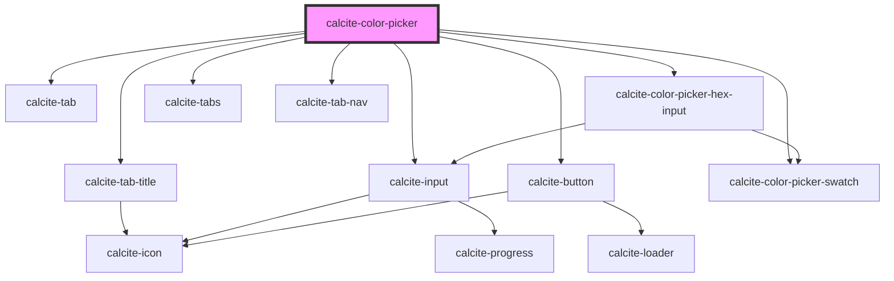

# calcite-color-picker

<!-- Auto Generated Below -->

## Usage

### Basic

```html
<calcite-color-picker dir="ltr" scale="m" value="#b33f33"></calcite-color-picker>
```

## Properties

| Property           | Attribute           | Description                                                                                                                                                                                                                                                                                                    | Type                                                                                                                                                                                                                                    | Default         |
| ------------------ | ------------------- | -------------------------------------------------------------------------------------------------------------------------------------------------------------------------------------------------------------------------------------------------------------------------------------------------------------- | --------------------------------------------------------------------------------------------------------------------------------------------------------------------------------------------------------------------------------------- | --------------- |
| `allowEmpty`       | `allow-empty`       | When `false`, an empty color (`null`) will be allowed as a `value`. Otherwise, a color value is enforced on the component. When `true`, a color value is enforced, and clearing the input or blurring will restore the last valid `value`. When `false`, an empty color (`null`) will be allowed as a `value`. | `boolean`                                                                                                                                                                                                                               | `false`         |
| `disabled`         | `disabled`          | When `true`, interaction is prevented and the component is displayed with lower opacity.                                                                                                                                                                                                                       | `boolean`                                                                                                                                                                                                                               | `false`         |
| `format`           | `format`            | The format of `value`. When `"auto"`, the format will be inferred from `value` when set.                                                                                                                                                                                                                       | `"auto" \| "hex" \| "hexa" \| "hsl" \| "hsl-css" \| "hsla" \| "hsla-css" \| "hsv" \| "hsva" \| "rgb" \| "rgb-css" \| "rgba" \| "rgba-css"`                                                                                              | `defaultFormat` |
| `hideChannels`     | `hide-channels`     | When `true`, hides the RGB/HSV channel inputs.                                                                                                                                                                                                                                                                 | `boolean`                                                                                                                                                                                                                               | `false`         |
| `hideHex`          | `hide-hex`          | When `true`, hides the Hex input.                                                                                                                                                                                                                                                                              | `boolean`                                                                                                                                                                                                                               | `false`         |
| `hideSaved`        | `hide-saved`        | When `true`, hides the saved colors section.                                                                                                                                                                                                                                                                   | `boolean`                                                                                                                                                                                                                               | `false`         |
| `messageOverrides` | `message-overrides` | Use this property to override individual strings used by the component.                                                                                                                                                                                                                                        | `ColorPickerMessages`                                                                                                                                                                                                                   | `undefined`     |
| `numberingSystem`  | `numbering-system`  | Specifies the Unicode numeral system used by the component for localization.                                                                                                                                                                                                                                   | `"arab" \| "arabext" \| "bali" \| "beng" \| "deva" \| "fullwide" \| "gujr" \| "guru" \| "hanidec" \| "khmr" \| "knda" \| "laoo" \| "latn" \| "limb" \| "mlym" \| "mong" \| "mymr" \| "orya" \| "tamldec" \| "telu" \| "thai" \| "tibt"` | `undefined`     |
| `scale`            | `scale`             | Specifies the size of the component.                                                                                                                                                                                                                                                                           | `"l" \| "m" \| "s"`                                                                                                                                                                                                                     | `"m"`           |
| `storageId`        | `storage-id`        | Specifies the storage ID for colors.                                                                                                                                                                                                                                                                           | `string`                                                                                                                                                                                                                                | `undefined`     |
| `value`            | `value`             | The component's value, where the value can be a CSS color string, or a RGB, HSL or HSV object. The type will be preserved as the color is updated.                                                                                                                                                             | `HSL \| HSL & ObjectWithAlpha \| HSV \| HSV & ObjectWithAlpha \| RGB \| RGB & ObjectWithAlpha \| string`                                                                                                                                | `defaultValue`  |

## Events

| Event                      | Description                                                                                                                                                                                                  | Type                |
| -------------------------- | ------------------------------------------------------------------------------------------------------------------------------------------------------------------------------------------------------------ | ------------------- |
| `calciteColorPickerChange` | Fires when the color value has changed.                                                                                                                                                                      | `CustomEvent<void>` |
| `calciteColorPickerInput`  | Fires as the color value changes. Similar to the `calciteColorPickerChange` event with the exception of dragging. When dragging the color field or hue slider thumb, this event fires as the thumb is moved. | `CustomEvent<void>` |

## Methods

### `setFocus() => Promise<void>`

Sets focus on the component's first focusable element.

#### Returns

Type: `Promise<void>`

## Dependencies

### Depends on

- [calcite-tab-title](../tab-title)
- [calcite-tab](../tab)
- [calcite-input](../input)
- [calcite-color-picker-hex-input](../color-picker-hex-input)
- [calcite-tabs](../tabs)
- [calcite-tab-nav](../tab-nav)
- [calcite-button](../button)
- [calcite-color-picker-swatch](../color-picker-swatch)

### Graph



---

_Built with [StencilJS](https://stenciljs.com/)_
