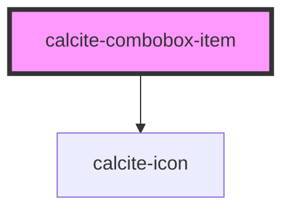

# calcite-combobox-item

<!-- Auto Generated Below -->

## Properties

| Property                 | Attribute         | Description                                                                              | Type      | Default     |
| ------------------------ | ----------------- | ---------------------------------------------------------------------------------------- | --------- | ----------- |
| `active`                 | `active`          | When `true`, the component is active.                                                    | `boolean` | `false`     |
| `ancestors`              | --                | Specifies the parent and grandparent items, which are set on `calcite-combobox`.         | `any[]`   | `undefined` |
| `disabled`               | `disabled`        | When `true`, interaction is prevented and the component is displayed with lower opacity. | `boolean` | `false`     |
| `filterDisabled`         | `filter-disabled` | When `true`, omits the component from the `calcite-combobox` filtered search results.    | `boolean` | `undefined` |
| `guid`                   | `guid`            | The `id` attribute of the component. When omitted, a globally unique identifier is used. | `string`  | `guid()`    |
| `icon`                   | `icon`            | Specifies an icon to display.                                                            | `string`  | `undefined` |
| `selected`               | `selected`        | When `true`, the component is selected.                                                  | `boolean` | `false`     |
| `textLabel` _(required)_ | `text-label`      | The component's text.                                                                    | `string`  | `undefined` |
| `value` _(required)_     | `value`           | The component's value.                                                                   | `any`     | `undefined` |

## Events

| Event                       | Description                                                                                                                                                   | Type               |
| --------------------------- | ------------------------------------------------------------------------------------------------------------------------------------------------------------- | ------------------ |
| `calciteComboboxItemChange` | Emits whenever the component is selected or unselected. **Note:**: The event's payload is deprecated, please use the event's `target`/`currentTarget` instead | `CustomEvent<any>` |

## Methods

### `toggleSelected(coerce?: boolean) => Promise<void>`

Used to toggle the selection state. By default this won't trigger an event.
The first argument allows the value to be coerced, rather than swapping values.

#### Returns

Type: `Promise<void>`

## Slots

| Slot | Description                                        |
| ---- | -------------------------------------------------- |
|      | A slot for adding nested `calcite-combobox-item`s. |

## Dependencies

### Depends on

- [calcite-icon](../icon)

### Graph

---

_Built with [StencilJS](https://stenciljs.com/)_
