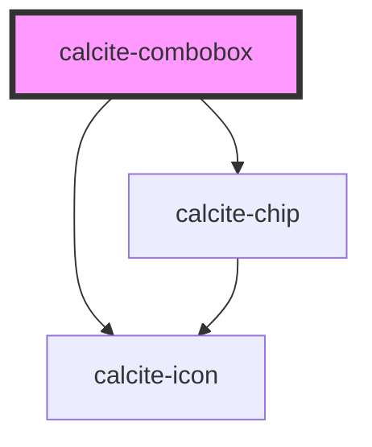

# calcite-combobox

<!-- Auto Generated Below -->

## Usage

### Ancestors

```html
<calcite-combobox label="Ancestors selection-mode combobox" selection-mode="ancestors">
  <calcite-combobox-item value="Trees" text-label="Trees">
    <calcite-combobox-item
      value="CommercialDamageAssessment - Damage to Commercial Buildings & Damage to Commercial Buildings"
      text-label="CommercialDamageAssessment - Damage to Commercial Buildings & Damage to Commercial Buildings"
      selected
    ></calcite-combobox-item>
    <calcite-combobox-item value="Sequoia" disabled text-label="Sequoia"></calcite-combobox-item>
    <calcite-combobox-item value="Douglas Fir" text-label="Douglas Fir"></calcite-combobox-item>
  </calcite-combobox-item>
</calcite-combobox>
```

### Multi

```html
<calcite-combobox label="Mulit selection-mode combobox" selection-mode="multi">
  <calcite-combobox-item value="Trees" text-label="Trees">
    <calcite-combobox-item
      value="CommercialDamageAssessment - Damage to Commercial Buildings & Damage to Commercial Buildings"
      text-label="CommercialDamageAssessment - Damage to Commercial Buildings & Damage to Commercial Buildings"
      selected
    ></calcite-combobox-item>
    <calcite-combobox-item value="Sequoia" disabled text-label="Sequoia"></calcite-combobox-item>
    <calcite-combobox-item value="Douglas Fir" text-label="Douglas Fir"></calcite-combobox-item>
  </calcite-combobox-item>
</calcite-combobox>
```

### Single

```html
<calcite-combobox label="Single selection-mode combobox" selection-mode="single">
  <calcite-combobox-item value="Trees" text-label="Trees">
    <calcite-combobox-item
      value="CommercialDamageAssessment - Damage to Commercial Buildings"
      text-label="CommercialDamageAssessment - Damage to Commercial Buildings"
      selected
    ></calcite-combobox-item>
    <calcite-combobox-item value="Sequoia" disabled text-label="Sequoia"></calcite-combobox-item>
    <calcite-combobox-item value="Douglas Fir" text-label="Douglas Fir"></calcite-combobox-item>
  </calcite-combobox-item>
  <calcite-combobox-item value="Rivers" text-label="Rivers"></calcite-combobox-item>
</calcite-combobox>
```

## Properties

| Property             | Attribute             | Description                                                                                                                                                                                                                    | Type                                 | Default          |
| -------------------- | --------------------- | ------------------------------------------------------------------------------------------------------------------------------------------------------------------------------------------------------------------------------ | ------------------------------------ | ---------------- |
| `active`             | `active`              | <span style="color:red">**[DEPRECATED]**</span> use open instead<br/><br/>When true, opens the combobox                                                                                                                        | `boolean`                            | `false`          |
| `allowCustomValues`  | `allow-custom-values` | Allow entry of custom values which are not in the original set of items                                                                                                                                                        | `boolean`                            | `undefined`      |
| `disabled`           | `disabled`            | Disable combobox input                                                                                                                                                                                                         | `boolean`                            | `false`          |
| `flipPlacements`     | --                    | Defines the available placements that can be used when a flip occurs.                                                                                                                                                          | `ComputedPlacement[]`                | `undefined`      |
| `intlRemoveTag`      | `intl-remove-tag`     | string to override the English "Remove tag" text for when an item is selected.                                                                                                                                                 | `string`                             | `TEXT.removeTag` |
| `label` _(required)_ | `label`               | Aria label for combobox (required)                                                                                                                                                                                             | `string`                             | `undefined`      |
| `maxItems`           | `max-items`           | Specify the maximum number of combobox items (including nested children) to display before showing the scroller                                                                                                                | `number`                             | `0`              |
| `name`               | `name`                | The name of the switch input                                                                                                                                                                                                   | `string`                             | `undefined`      |
| `open`               | `open`                | When true, opens the combobox                                                                                                                                                                                                  | `boolean`                            | `false`          |
| `overlayPositioning` | `overlay-positioning` | Describes the type of positioning to use for the overlaid content. If your element is in a fixed container, use the 'fixed' value.                                                                                             | `"absolute" \| "fixed"`              | `"absolute"`     |
| `placeholder`        | `placeholder`         | Placeholder text for input                                                                                                                                                                                                     | `string`                             | `undefined`      |
| `placeholderIcon`    | `placeholder-icon`    | Placeholder icon for input                                                                                                                                                                                                     | `string`                             | `undefined`      |
| `scale`              | `scale`               | Specify the scale of the combobox, defaults to m                                                                                                                                                                               | `"l" \| "m" \| "s"`                  | `"m"`            |
| `selectionMode`      | `selection-mode`      | specify the selection mode - multi: allow any number of selected items (default) - single: only one selection) - ancestors: like multi, but show ancestors of selected items as selected, only deepest children shown in chips | `"ancestors" \| "multi" \| "single"` | `"multi"`        |
| `value`              | `value`               | The value(s) of the selectedItem(s)                                                                                                                                                                                            | `string \| string[]`                 | `null`           |

## Events

| Event                         | Description                                                                                                                           | Type                                                                             |
| ----------------------------- | ------------------------------------------------------------------------------------------------------------------------------------- | -------------------------------------------------------------------------------- |
| `calciteComboboxBeforeClose`  |                                                                                                                                       | `CustomEvent<{ el: HTMLCalciteComboboxElement; }>`                               |
| `calciteComboboxBeforeOpen`   |                                                                                                                                       | `CustomEvent<{ el: HTMLCalciteComboboxElement; }>`                               |
| `calciteComboboxChange`       | Called when the selected item(s) changes.                                                                                             | `CustomEvent<{ selectedItems: HTMLCalciteComboboxItemElement[]; }>`              |
| `calciteComboboxChipDismiss`  | Called when a selected item in the combobox is dismissed via its chip                                                                 | `CustomEvent<any>`                                                               |
| `calciteComboboxClose`        |                                                                                                                                       | `CustomEvent<{ el: HTMLCalciteComboboxElement; }>`                               |
| `calciteComboboxFilterChange` | Called when the user has entered text to filter the options list                                                                      | `CustomEvent<{ visibleItems: HTMLCalciteComboboxItemElement[]; text: string; }>` |
| `calciteComboboxOpen`         |                                                                                                                                       | `CustomEvent<{ el: HTMLCalciteComboboxElement; }>`                               |
| `calciteLookupChange`         | <span style="color:red">**[DEPRECATED]**</span> use calciteComboboxChange instead<br/><br/>Called when the selected items set changes | `CustomEvent<HTMLCalciteComboboxItemElement[]>`                                  |

## Methods

### `reposition() => Promise<void>`

Updates the position of the component.

#### Returns

Type: `Promise<void>`

### `setFocus() => Promise<void>`

Sets focus on the component.

#### Returns

Type: `Promise<void>`

## Slots

| Slot | Description                                 |
| ---- | ------------------------------------------- |
|      | A slot for adding `calcite-combobox-item`s. |

## CSS Custom Properties

| Name                              | Description                      |
| --------------------------------- | -------------------------------- |
| `--calcite-combobox-input-height` | the height of the combobox input |

## Dependencies

### Depends on

- [calcite-chip](../chip)
- [calcite-icon](../icon)

### Graph



---

_Built with [StencilJS](https://stenciljs.com/)_
