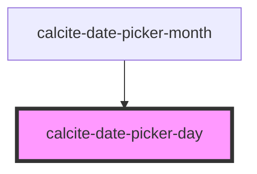

# calcite-date-day

<!-- Auto Generated Below -->

## Properties

| Property           | Attribute        | Description                                                                              | Type                | Default     |
| ------------------ | ---------------- | ---------------------------------------------------------------------------------------- | ------------------- | ----------- |
| `active`           | `active`         | When `true`, the component is active.                                                    | `boolean`           | `false`     |
| `currentMonth`     | `current-month`  | Date is in the current month.                                                            | `boolean`           | `false`     |
| `day` _(required)_ | `day`            | Day of the month to be shown.                                                            | `number`            | `undefined` |
| `disabled`         | `disabled`       | When `true`, interaction is prevented and the component is displayed with lower opacity. | `boolean`           | `false`     |
| `endOfRange`       | `end-of-range`   | Date is the end of date range                                                            | `boolean`           | `false`     |
| `highlighted`      | `highlighted`    | Date is currently highlighted as part of the range                                       | `boolean`           | `false`     |
| `range`            | `range`          | When `true`, activates the component's range mode to allow a start and end date.         | `boolean`           | `false`     |
| `rangeHover`       | `range-hover`    | Date is being hovered and within the set range                                           | `boolean`           | `false`     |
| `scale`            | `scale`          | Specifies the size of the component.                                                     | `"l" \| "m" \| "s"` | `undefined` |
| `selected`         | `selected`       | When `true`, the component is selected.                                                  | `boolean`           | `false`     |
| `startOfRange`     | `start-of-range` | Date is the start of date range                                                          | `boolean`           | `false`     |
| `value`            | --               | The component's value.                                                                   | `Date`              | `undefined` |

## Events

| Event              | Description                   | Type                |
| ------------------ | ----------------------------- | ------------------- |
| `calciteDaySelect` | Emitted when user selects day | `CustomEvent<void>` |

## Dependencies

### Used by

- [calcite-date-picker-month](../date-picker-month)

### Graph

---

_Built with [StencilJS](https://stenciljs.com/)_
