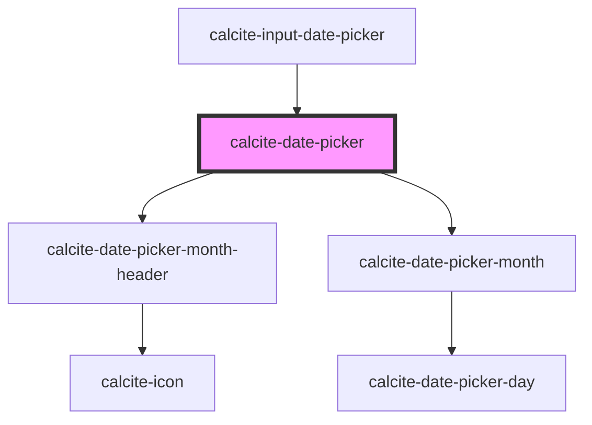

# calcite-date-picker

The `calcite-date-picker` component allows for selecting a date via a calendar or text input. It supports multiple locales, languages, right to left, and is fully keyboard accessible.

<!-- Auto Generated Below -->

## Usage

### Basic

You can set a min and max range, as well as an initial value with ISO 8601 formatted strings:

```html
<calcite-date-picker value="2020-03-27" min="2020-02-01" max="2021-01-01"></calcite-date-picker>
```

### Range

You can also add range property to activate date range mode. In this mode, you can specify start and end instead of the single value property.

```html
<calcite-date-picker range start="2020-03-15" end="2020-03-27" min="2020-02-01" max="2021-01-01" />
```

## Properties

| Property                     | Attribute                      | Description                                                                                                                                                                  | Type                                                                                                                                                                                                                                    | Default          |
| ---------------------------- | ------------------------------ | ---------------------------------------------------------------------------------------------------------------------------------------------------------------------------- | --------------------------------------------------------------------------------------------------------------------------------------------------------------------------------------------------------------------------------------- | ---------------- |
| `activeDate`                 | --                             | Specifies the component's active date.                                                                                                                                       | `Date`                                                                                                                                                                                                                                  | `undefined`      |
| `activeRange`                | `active-range`                 | When `range` is true, specifies the active `range`. Where `"start"` specifies the starting range date and `"end"` the ending range date.                                     | `"end" \| "start"`                                                                                                                                                                                                                      | `undefined`      |
| `end`                        | `end`                          | <span style="color:red">**[DEPRECATED]**</span> use `value` instead.<br/><br/>Specifies the selected end date.                                                               | `string`                                                                                                                                                                                                                                | `undefined`      |
| `endAsDate`                  | --                             | <span style="color:red">**[DEPRECATED]**</span> use `valueAsDate` instead.<br/><br/>Specifies the selected end date as a full date object.                                   | `Date`                                                                                                                                                                                                                                  | `undefined`      |
| `headingLevel`               | `heading-level`                | Specifies the number at which section headings should start.                                                                                                                 | `1 \| 2 \| 3 \| 4 \| 5 \| 6`                                                                                                                                                                                                            | `undefined`      |
| `intlNextMonth`              | `intl-next-month`              | Accessible name for the component's next month button.                                                                                                                       | `string`                                                                                                                                                                                                                                | `TEXT.nextMonth` |
| `intlPrevMonth`              | `intl-prev-month`              | Accessible name for the component's previous month button.                                                                                                                   | `string`                                                                                                                                                                                                                                | `TEXT.prevMonth` |
| `intlYear`                   | `intl-year`                    | Accessible name for the component's year input.                                                                                                                              | `string`                                                                                                                                                                                                                                | `TEXT.year`      |
| `max`                        | `max`                          | Specifies the latest allowed date (`"yyyy-mm-dd"`).                                                                                                                          | `string`                                                                                                                                                                                                                                | `undefined`      |
| `maxAsDate`                  | --                             | Specifies the latest allowed date as a full date object (`new Date("yyyy-mm-dd")`).                                                                                          | `Date`                                                                                                                                                                                                                                  | `undefined`      |
| `min`                        | `min`                          | Specifies the earliest allowed date (`"yyyy-mm-dd"`).                                                                                                                        | `string`                                                                                                                                                                                                                                | `undefined`      |
| `minAsDate`                  | --                             | Specifies the earliest allowed date as a full date object (`new Date("yyyy-mm-dd")`).                                                                                        | `Date`                                                                                                                                                                                                                                  | `undefined`      |
| `numberingSystem`            | `numbering-system`             | Specifies the Unicode numeral system used by the component for localization. This property cannot be dynamically changed.                                                    | `"arab" \| "arabext" \| "bali" \| "beng" \| "deva" \| "fullwide" \| "gujr" \| "guru" \| "hanidec" \| "khmr" \| "knda" \| "laoo" \| "latn" \| "limb" \| "mlym" \| "mong" \| "mymr" \| "orya" \| "tamldec" \| "telu" \| "thai" \| "tibt"` | `undefined`      |
| `proximitySelectionDisabled` | `proximity-selection-disabled` | When `true`, disables the default behavior on the third click of narrowing or extending the range and instead starts a new range.                                            | `boolean`                                                                                                                                                                                                                               | `false`          |
| `range`                      | `range`                        | When `true`, activates the component's range mode to allow a start and end date.                                                                                             | `boolean`                                                                                                                                                                                                                               | `false`          |
| `scale`                      | `scale`                        | Specifies the size of the component.                                                                                                                                         | `"l" \| "m" \| "s"`                                                                                                                                                                                                                     | `"m"`            |
| `start`                      | `start`                        | <span style="color:red">**[DEPRECATED]**</span> use `value` instead.<br/><br/>Specifies the selected start date.                                                             | `string`                                                                                                                                                                                                                                | `undefined`      |
| `startAsDate`                | --                             | <span style="color:red">**[DEPRECATED]**</span> use `valueAsDate` instead.<br/><br/>Specifies the selected start date as a full date object.                                 | `Date`                                                                                                                                                                                                                                  | `undefined`      |
| `value`                      | `value`                        | Specifies the selected date as a string (`"yyyy-mm-dd"`), or an array of strings for `range` values (`["yyyy-mm-dd", "yyyy-mm-dd"]`).                                        | `string \| string[]`                                                                                                                                                                                                                    | `undefined`      |
| `valueAsDate`                | --                             | Specifies the selected date as a full date object (`new Date("yyyy-mm-dd")`), or an array containing full date objects (`[new Date("yyyy-mm-dd"), new Date("yyyy-mm-dd")]`). | `Date \| Date[]`                                                                                                                                                                                                                        | `undefined`      |

## Events

| Event                          | Description                                                                                                           | Type                           |
| ------------------------------ | --------------------------------------------------------------------------------------------------------------------- | ------------------------------ |
| `calciteDatePickerChange`      | Emits when a user changes the component's date. For `range` events, use `calciteDatePickerRangeChange`.               | `CustomEvent<Date>`            |
| `calciteDatePickerRangeChange` | Emits when a user changes the component's date `range`. For components without `range` use `calciteDatePickerChange`. | `CustomEvent<DateRangeChange>` |

## Dependencies

### Used by

- [calcite-input-date-picker](../input-date-picker)

### Depends on

- [calcite-date-picker-month-header](../date-picker-month-header)
- [calcite-date-picker-month](../date-picker-month)

### Graph



---

_Built with [StencilJS](https://stenciljs.com/)_
