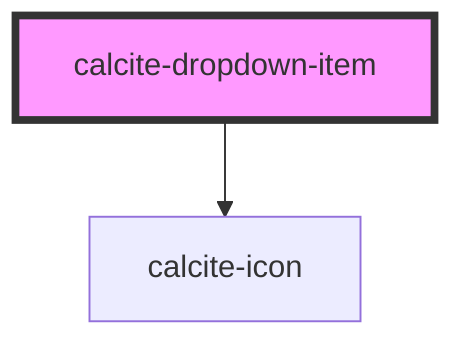

# calcite-dropdown-item

<!-- Auto Generated Below -->

## Properties

| Property      | Attribute       | Description                                                                                                                                       | Type                         | Default     |
| ------------- | --------------- | ------------------------------------------------------------------------------------------------------------------------------------------------- | ---------------------------- | ----------- |
| `href`        | `href`          | Specifies the URL of the linked resource, which can be set as an absolute or relative path. Determines if the component will render as an anchor. | `string`                     | `undefined` |
| `iconEnd`     | `icon-end`      | Specifies an icon to display at the end of the component.                                                                                         | `string`                     | `undefined` |
| `iconFlipRtl` | `icon-flip-rtl` | Displays the `iconStart` and/or `iconEnd` as flipped when the element direction is right-to-left (`"rtl"`).                                       | `"both" \| "end" \| "start"` | `undefined` |
| `iconStart`   | `icon-start`    | Specifies an icon to display at the start of the component.                                                                                       | `string`                     | `undefined` |
| `label`       | `label`         | Accessible name for the component.                                                                                                                | `string`                     | `undefined` |
| `rel`         | `rel`           | Specifies the relationship to the linked document defined in `href`.                                                                              | `string`                     | `undefined` |
| `selected`    | `selected`      | When `true`, the component is selected.                                                                                                           | `boolean`                    | `false`     |
| `target`      | `target`        | Specifies the frame or window to open the linked document.                                                                                        | `string`                     | `undefined` |

## Events

| Event                       | Description                           | Type                |
| --------------------------- | ------------------------------------- | ------------------- |
| `calciteDropdownItemSelect` | Fires when the component is selected. | `CustomEvent<void>` |

## Methods

### `setFocus() => Promise<void>`

Sets focus on the component.

#### Returns

Type: `Promise<void>`

## Slots

| Slot | Description             |
| ---- | ----------------------- |
|      | A slot for adding text. |

## Dependencies

### Depends on

- [calcite-icon](../icon)

### Graph

---

_Built with [StencilJS](https://stenciljs.com/)_
