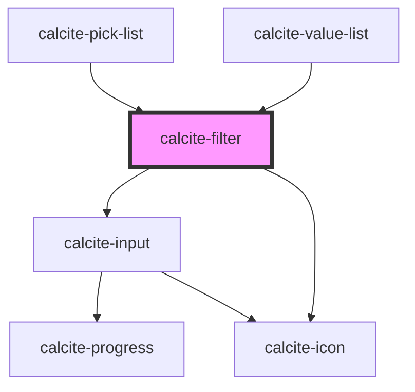

# calcite-filter

<!-- Auto Generated Below -->

## Properties

| Property        | Attribute     | Description                                                                                                                                                                                                     | Type                | Default     |
| --------------- | ------------- | --------------------------------------------------------------------------------------------------------------------------------------------------------------------------------------------------------------- | ------------------- | ----------- |
| `disabled`      | `disabled`    | When true, disabled prevents interaction. This state shows items with lower opacity/grayed.                                                                                                                     | `boolean`           | `false`     |
| `filteredItems` | --            | The resulting items after filtering.                                                                                                                                                                            | `object[]`          | `[]`        |
| `intlClear`     | `intl-clear`  | A text label that will appear on the clear button.                                                                                                                                                              | `string`            | `undefined` |
| `intlLabel`     | `intl-label`  | A text label that will appear next to the input field.                                                                                                                                                          | `string`            | `undefined` |
| `items`         | --            | The items to filter through. The filter uses this as the starting point, and returns items that contain the string entered in the input, using a partial match and recursive search. This property is required. | `object[]`          | `[]`        |
| `placeholder`   | `placeholder` | Placeholder text for the input element's placeholder attribute                                                                                                                                                  | `string`            | `undefined` |
| `scale`         | `scale`       | specify the scale of filter, defaults to m                                                                                                                                                                      | `"l" \| "m" \| "s"` | `"m"`       |
| `value`         | `value`       | Filter value.                                                                                                                                                                                                   | `string`            | `""`        |

## Events

| Event                 | Description                                    | Type                |
| --------------------- | ---------------------------------------------- | ------------------- |
| `calciteFilterChange` | This event fires when the filter text changes. | `CustomEvent<void>` |

## Methods

### `setFocus() => Promise<void>`

Sets focus on the component.

#### Returns

Type: `Promise<void>`

## Dependencies

### Used by

- [calcite-pick-list](../pick-list)
- [calcite-value-list](../value-list)

### Depends on

- [calcite-input](../input)
- [calcite-icon](../icon)

### Graph

---

_Built with [StencilJS](https://stenciljs.com/)_
