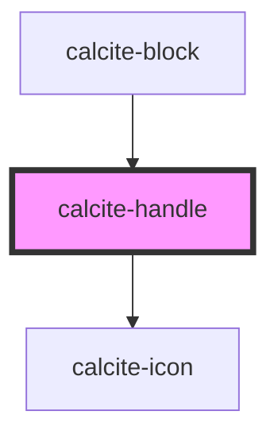

# calcite-handle

<!-- Auto Generated Below -->

## Properties

| Property           | Attribute     | Description                                                             | Type                       | Default     |
| ------------------ | ------------- | ----------------------------------------------------------------------- | -------------------------- | ----------- |
| `dragHandle`       | `drag-handle` | Value for the button title attribute                                    | `string`                   | `undefined` |
| `messageOverrides` | --            | Use this property to override individual strings used by the component. | `{ dragHandle?: string; }` | `undefined` |

## Events

| Event                | Description                                                                   | Type                       |
| -------------------- | ----------------------------------------------------------------------------- | -------------------------- |
| `calciteHandleNudge` | Emitted when the handle is activated and the up or down arrow key is pressed. | `CustomEvent<HandleNudge>` |

## Methods

### `setFocus() => Promise<void>`

Sets focus on the component.

#### Returns

Type: `Promise<void>`

## Dependencies

### Used by

- [calcite-block](../block)

### Depends on

- [calcite-icon](../icon)

### Graph

---

_Built with [StencilJS](https://stenciljs.com/)_
