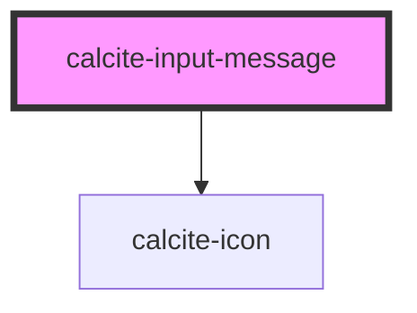

# calcite-input-message

Displays a contextual message to a user. Allows the passing of content, links, etc.

<!-- Auto Generated Below -->

## Usage

### Basic

```html
<calcite-label status="“invalid”">
  My great label
  <calcite-input placeholder="“Enter" your information”></calcite-input>
  <calcite-input-message active
    >That's not going to work out.
    <calcite-button appearance="inline" href="">Learn more</calcite-button></calcite-input-message
  >
</calcite-label>
```

## Properties

| Property | Attribute | Description                                                                                                                                                                                                                                                      | Type                             | Default     |
| -------- | --------- | ---------------------------------------------------------------------------------------------------------------------------------------------------------------------------------------------------------------------------------------------------------------- | -------------------------------- | ----------- |
| `active` | `active`  | When `true`, the component is active.                                                                                                                                                                                                                            | `boolean`                        | `false`     |
| `icon`   | `icon`    | Specifies an icon to display.                                                                                                                                                                                                                                    | `boolean \| string`              | `undefined` |
| `scale`  | `scale`   | Specifies the size of the component.                                                                                                                                                                                                                             | `"l" \| "m" \| "s"`              | `"m"`       |
| `status` | `status`  | Specifies the status of the input field, which determines message and icons.                                                                                                                                                                                     | `"idle" \| "invalid" \| "valid"` | `"idle"`    |
| `type`   | `type`    | <span style="color:red">**[DEPRECATED]**</span> The `"floating"` type is no longer supported.<br/><br/>Specifies the appearance of a slotted message - `"default"` (displayed under the component), or `"floating"` (positioned absolutely under the component). | `"default"`                      | `undefined` |

## Slots

| Slot | Description             |
| ---- | ----------------------- |
|      | A slot for adding text. |

## CSS Custom Properties

| Name                                    | Description                                 |
| --------------------------------------- | ------------------------------------------- |
| `--calcite-input-message-spacing-value` | The top margin spacing above the component. |

## Dependencies

### Depends on

- [calcite-icon](../icon)

### Graph



---

_Built with [StencilJS](https://stenciljs.com/)_
