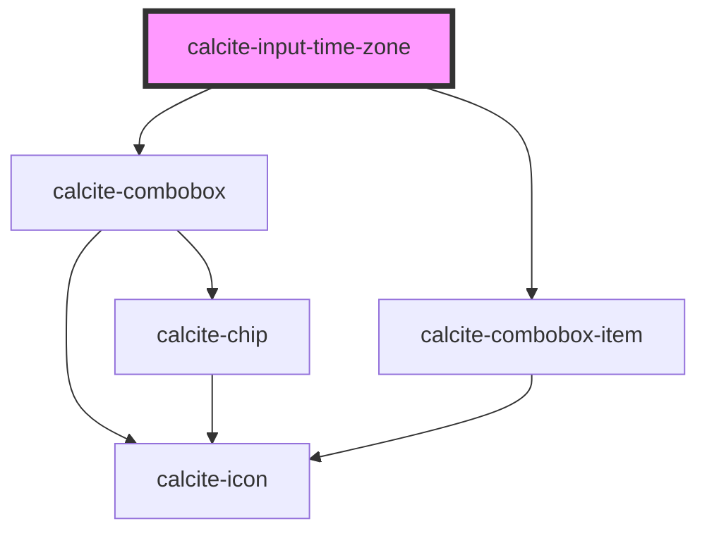

# calcite-input-time-zone

<!-- Auto Generated Below -->

## Properties

| Property           | Attribute  | Description                                                                                                                                                               | Type                                                                                                                                                                                                                                                                                                                                                                                                                                                                                                                                                                                                                                                                                                                                                                                                                                                                                                                                                                                                                                                                                                                                                                                                                                                                                                                                                                                                                                                                                                                                                                                                                                                                                                                                                                                                                                                                                                                                                                                                                                                                                                                                                                                                                                                                                                                                                                                                                                                                                                                                                                                                                                                                                                                                                                                                                                                                                                                                                                                                                                                                                                                                         | Default     |
| ------------------ | ---------- | ------------------------------------------------------------------------------------------------------------------------------------------------------------------------- | -------------------------------------------------------------------------------------------------------------------------------------------------------------------------------------------------------------------------------------------------------------------------------------------------------------------------------------------------------------------------------------------------------------------------------------------------------------------------------------------------------------------------------------------------------------------------------------------------------------------------------------------------------------------------------------------------------------------------------------------------------------------------------------------------------------------------------------------------------------------------------------------------------------------------------------------------------------------------------------------------------------------------------------------------------------------------------------------------------------------------------------------------------------------------------------------------------------------------------------------------------------------------------------------------------------------------------------------------------------------------------------------------------------------------------------------------------------------------------------------------------------------------------------------------------------------------------------------------------------------------------------------------------------------------------------------------------------------------------------------------------------------------------------------------------------------------------------------------------------------------------------------------------------------------------------------------------------------------------------------------------------------------------------------------------------------------------------------------------------------------------------------------------------------------------------------------------------------------------------------------------------------------------------------------------------------------------------------------------------------------------------------------------------------------------------------------------------------------------------------------------------------------------------------------------------------------------------------------------------------------------------------------------------------------------------------------------------------------------------------------------------------------------------------------------------------------------------------------------------------------------------------------------------------------------------------------------------------------------------------------------------------------------------------------------------------------------------------------------------------------------------------- | ----------- |
| `disabled`         | `disabled` | When true, prevents user interaction. Notes: This prop should use the @Prop decorator and reflect. The `disabled` Sass mixin must be added to the component's stylesheet. | `boolean`                                                                                                                                                                                                                                                                                                                                                                                                                                                                                                                                                                                                                                                                                                                                                                                                                                                                                                                                                                                                                                                                                                                                                                                                                                                                                                                                                                                                                                                                                                                                                                                                                                                                                                                                                                                                                                                                                                                                                                                                                                                                                                                                                                                                                                                                                                                                                                                                                                                                                                                                                                                                                                                                                                                                                                                                                                                                                                                                                                                                                                                                                                                                    | `false`     |
| `messageOverrides` | --         | Use this property to override individual strings used by the component.                                                                                                   | `{ chooseTimeZone?: string; timeZoneLabel?: string; "Africa/Bujumbura"?: string; "Africa/Ceuta"?: string; "Africa/Djibouti"?: string; "Africa/El_Aaiun"?: string; "Africa/Luanda"?: string; "Africa/Ouagadougou"?: string; "America/Adak"?: string; "America/Anchorage"?: string; "America/Antigua"?: string; "America/Argentina/Buenos_Aires"?: string; "America/Asuncion"?: string; "America/Belem"?: string; "America/Belize"?: string; "America/Creston"?: string; "America/Danmarkshavn"?: string; "America/Edmonton"?: string; "America/Eirunepe"?: string; "America/Halifax"?: string; "America/Mazatlan"?: string; "America/Mexico_City"?: string; "America/Miquelon"?: string; "America/Nassau"?: string; "America/Noronha"?: string; "America/Nuuk"?: string; "America/Santiago"?: string; "America/Scoresbysund"?: string; "America/St_Johns"?: string; "America/Vancouver"?: string; "America/Winnipeg"?: string; "Antarctica/Casey"?: string; "Antarctica/Davis"?: string; "Antarctica/DumontDUrville"?: string; "Antarctica/Macquarie"?: string; "Antarctica/Mawson"?: string; "Antarctica/McMurdo"?: string; "Antarctica/Palmer"?: string; "Antarctica/Syowa"?: string; "Antarctica/Troll"?: string; "Antarctica/Vostok"?: string; "Arctic/Longyearbyen"?: string; "Asia/Amman"?: string; "Asia/Bahrain"?: string; "Asia/Beirut"?: string; "Asia/Brunei"?: string; "Asia/Damascus"?: string; "Asia/Dhaka"?: string; "Asia/Dubai"?: string; "Asia/Gaza"?: string; "Asia/Jakarta"?: string; "Asia/Jayapura"?: string; "Asia/Jerusalem"?: string; "Asia/Kabul"?: string; "Asia/Kamchatka"?: string; "Asia/Kathmandu"?: string; "Asia/Kolkata"?: string; "Asia/Magadan"?: string; "Asia/Nicosia"?: string; "Asia/Qyzylorda"?: string; "Asia/Tehran"?: string; "Asia/Vladivostok"?: string; "Asia/Yangon"?: string; "Atlantic/Azores"?: string; "Atlantic/Bermuda"?: string; "Atlantic/Canary"?: string; "Atlantic/Cape_Verde"?: string; "Atlantic/Reykjavik"?: string; "Atlantic/South_Georgia"?: string; "Atlantic/Stanley"?: string; "Australia/Brisbane"?: string; "Australia/Broken_Hill"?: string; "Australia/Darwin"?: string; "Australia/Eucla"?: string; "Australia/Hobart"?: string; "Australia/Lord_Howe"?: string; "Australia/Perth"?: string; "Europe/Andorra"?: string; "Europe/Astrakhan"?: string; "Europe/Kaliningrad"?: string; "Europe/London"?: string; "Europe/Mariehamn"?: string; "Europe/Minsk"?: string; "Indian/Chagos"?: string; "Indian/Christmas"?: string; "Indian/Cocos"?: string; "Indian/Comoro"?: string; "Indian/Maldives"?: string; "Indian/Mauritius"?: string; "Pacific/Apia"?: string; "Pacific/Auckland"?: string; "Pacific/Chatham"?: string; "Pacific/Chuuk"?: string; "Pacific/Easter"?: string; "Pacific/Enderbury"?: string; "Pacific/Fiji"?: string; "Pacific/Galapagos"?: string; "Pacific/Gambier"?: string; "Pacific/Kiritimati"?: string; "Pacific/Marquesas"?: string; "Pacific/Norfolk"?: string; "Pacific/Pago_Pago"?: string; "Pacific/Palau"?: string; "Pacific/Pitcairn"?: string; "Pacific/Pohnpei"?: string; "Pacific/Rarotonga"?: string; "Pacific/Tarawa"?: string; }` | `undefined` |
| `scale`            | `scale`    | Specifies the size of the component.                                                                                                                                      | `"l" \| "m" \| "s"`                                                                                                                                                                                                                                                                                                                                                                                                                                                                                                                                                                                                                                                                                                                                                                                                                                                                                                                                                                                                                                                                                                                                                                                                                                                                                                                                                                                                                                                                                                                                                                                                                                                                                                                                                                                                                                                                                                                                                                                                                                                                                                                                                                                                                                                                                                                                                                                                                                                                                                                                                                                                                                                                                                                                                                                                                                                                                                                                                                                                                                                                                                                          | `"m"`       |
| `value`            | `value`    |                                                                                                                                                                           | `number`                                                                                                                                                                                                                                                                                                                                                                                                                                                                                                                                                                                                                                                                                                                                                                                                                                                                                                                                                                                                                                                                                                                                                                                                                                                                                                                                                                                                                                                                                                                                                                                                                                                                                                                                                                                                                                                                                                                                                                                                                                                                                                                                                                                                                                                                                                                                                                                                                                                                                                                                                                                                                                                                                                                                                                                                                                                                                                                                                                                                                                                                                                                                     | `null`      |

## Events

| Event                              | Description | Type                |
| ---------------------------------- | ----------- | ------------------- |
| `calciteInputTimeZonePickerChange` |             | `CustomEvent<void>` |

## Methods

### `setFocus() => Promise<void>`

#### Returns

Type: `Promise<void>`

## Dependencies

### Depends on

- [calcite-combobox](../combobox)
- [calcite-combobox-item](../combobox-item)

### Graph

---

_Built with [StencilJS](https://stenciljs.com/)_
