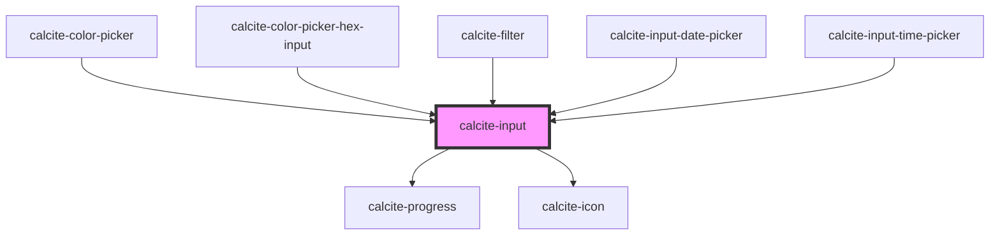

# calcite-input

<!-- Auto Generated Below -->

## Usage

### Basic

```html
<calcite-input value="Entered value" placeholder="My placeholder"></calcite-input>
```

### Clearable

```html
<calcite-label>
  Clearable item
  <calcite-input clearable value="My great name" placeholder="John Doe"></calcite-input>
</calcite-label>
```

### Native-events

You can also listen for native events emitted from `<calcite-input>`.

You must use `focusin`/`focusout` instead of `focus`/`blur` because these events bubble up from the rendered child element rendered inside of `<calcite-input>`

All events return an element and a value:

```js
input.addEventListener("focusin", logFocus);
input.addEventListener("focusout", logBlur);

function logChange() {
  console.log(event.target.element);
  console.log(event.target.value);
}
```

### With-label

Using a wrapping `calcite-label` component lets consumers set the status attribute once and have it propagate to child `calcite-input` and `calcite-input-message` elements

```html
<calcite-label status="invalid" for="invalid-input">
  Invalid input
  <calcite-input id="invalid-input" placeholder="Filter your files" value="adfo2h2"></calcite-input>
  <calcite-input-message active icon> Something doesn't look right </calcite-input-message>
</calcite-label>
```

### With-message

```html
<calcite-label for="info">
  My great label
  <calcite-input id="info" placeholder="Enter your information"></calcite-input>
  <calcite-input-message icon="3d-glasses" active>
    Here's something you should know about this input
  </calcite-input-message>
</calcite-label>
```

## Properties

| Property           | Attribute            | Description                                                                                                                                                                                    | Type                                                                                                                                                                                   | Default                                   |
| ------------------ | -------------------- | ---------------------------------------------------------------------------------------------------------------------------------------------------------------------------------------------- | -------------------------------------------------------------------------------------------------------------------------------------------------------------------------------------- | ----------------------------------------- |
| `alignment`        | `alignment`          | Specifies the text alignment of the component's value.                                                                                                                                         | `"end" \| "start"`                                                                                                                                                                     | `"start"`                                 |
| `autofocus`        | `autofocus`          | When true, the component is focused on page load.                                                                                                                                              | `boolean`                                                                                                                                                                              | `false`                                   |
| `clearable`        | `clearable`          | When true, a clear button is displayed when the component has a value. The clear button shows by default for "search", "time", and "date" types, and will not display for the "textarea" type. | `boolean`                                                                                                                                                                              | `false`                                   |
| `disabled`         | `disabled`           | When true, interaction is prevented and the component is displayed with lower opacity.                                                                                                         | `boolean`                                                                                                                                                                              | `false`                                   |
| `groupSeparator`   | `group-separator`    | When true, number values are displayed with the locale's group separator.                                                                                                                      | `boolean`                                                                                                                                                                              | `false`                                   |
| `hidden`           | `hidden`             | When true, the component will not be visible.                                                                                                                                                  | `boolean`                                                                                                                                                                              | `false`                                   |
| `icon`             | `icon`               | When true, shows a default recommended icon. Alternatively, pass a Calcite UI Icon name to display a specific icon.                                                                            | `boolean \| string`                                                                                                                                                                    | `undefined`                               |
| `iconFlipRtl`      | `icon-flip-rtl`      | When true, the icon is flipped in RTL.                                                                                                                                                         | `boolean`                                                                                                                                                                              | `false`                                   |
| `intlClear`        | `intl-clear`         | A text label that will appear on the clear button for screen readers.                                                                                                                          | `string`                                                                                                                                                                               | `undefined`                               |
| `intlLoading`      | `intl-loading`       | Accessible name that will appear while loading.                                                                                                                                                | `string`                                                                                                                                                                               | `COMMON_TEXT.loading`                     |
| `label`            | `label`              | Accessible name for the component's button or hyperlink.                                                                                                                                       | `string`                                                                                                                                                                               | `undefined`                               |
| `loading`          | `loading`            | When true, the component is in the loading state and `calcite-progress` is displayed.                                                                                                          | `boolean`                                                                                                                                                                              | `false`                                   |
| `locale`           | `locale`             | Specifies the BCP 47 language tag for the desired language and country format.                                                                                                                 | `string`                                                                                                                                                                               | `document.documentElement.lang \|\| "en"` |
| `max`              | `max`                | Specifies the maximum value for type "number".                                                                                                                                                 | `number`                                                                                                                                                                               | `undefined`                               |
| `maxLength`        | `max-length`         | Specifies the maximum length of text for the component's value.                                                                                                                                | `number`                                                                                                                                                                               | `undefined`                               |
| `maxlength`        | `maxlength`          | <span style="color:red">**[DEPRECATED]**</span> use maxLength instead<br/><br/>Specifies the maximum length of text for the component's value.                                                 | `number`                                                                                                                                                                               | `undefined`                               |
| `min`              | `min`                | Specifies the minimum value for type "number".                                                                                                                                                 | `number`                                                                                                                                                                               | `undefined`                               |
| `minLength`        | `min-length`         | Specifies the minimum length of text for the component's value.                                                                                                                                | `number`                                                                                                                                                                               | `undefined`                               |
| `name`             | `name`               | Specifies the name of the component.                                                                                                                                                           | `string`                                                                                                                                                                               | `undefined`                               |
| `numberButtonType` | `number-button-type` | Specifies the placement of the buttons for type "number".                                                                                                                                      | `"horizontal" \| "none" \| "vertical"`                                                                                                                                                 | `"vertical"`                              |
| `numberingSystem`  | `numbering-system`   | Specifies the Unicode numeral system used by the component for localization.                                                                                                                   | `string`                                                                                                                                                                               | `undefined`                               |
| `placeholder`      | `placeholder`        | Specifies placeholder text for the component.                                                                                                                                                  | `string`                                                                                                                                                                               | `undefined`                               |
| `prefixText`       | `prefix-text`        | Adds text to the start of the component.                                                                                                                                                       | `string`                                                                                                                                                                               | `undefined`                               |
| `readOnly`         | `read-only`          | When true, the value cannot be modified.                                                                                                                                                       | `boolean`                                                                                                                                                                              | `false`                                   |
| `required`         | `required`           | When true, the component must have a value in order for the form to submit.                                                                                                                    | `boolean`                                                                                                                                                                              | `false`                                   |
| `scale`            | `scale`              | Specifies the size of the component.                                                                                                                                                           | `"l" \| "m" \| "s"`                                                                                                                                                                    | `"m"`                                     |
| `status`           | `status`             | Specifies the status of the input field, which determines message and icons.                                                                                                                   | `"idle" \| "invalid" \| "valid"`                                                                                                                                                       | `"idle"`                                  |
| `step`             | `step`               | Specifies the granularity that the component's value must adhere to.                                                                                                                           | `"any" \| number`                                                                                                                                                                      | `undefined`                               |
| `suffixText`       | `suffix-text`        | Adds text to the end of the component.                                                                                                                                                         | `string`                                                                                                                                                                               | `undefined`                               |
| `type`             | `type`               | Specifies the component type. Note that the following types add type-specific icons by default: "date", "email", "password", "search", "tel", "time".                                          | `"color" \| "date" \| "datetime-local" \| "email" \| "file" \| "image" \| "month" \| "number" \| "password" \| "search" \| "tel" \| "text" \| "textarea" \| "time" \| "url" \| "week"` | `"text"`                                  |
| `value`            | `value`              | The component's value.                                                                                                                                                                         | `string`                                                                                                                                                                               | `""`                                      |

## Events

| Event                | Description                                                                                                                                                   | Type                |
| -------------------- | ------------------------------------------------------------------------------------------------------------------------------------------------------------- | ------------------- |
| `calciteInputChange` | Fires each time a new value is typed and committed.                                                                                                           | `CustomEvent<void>` |
| `calciteInputInput`  | Fires each time a new value is typed. **Note:**: The `el` and `value` event payload props are deprecated, please use the event's target/currentTarget instead | `CustomEvent<any>`  |

## Methods

### `selectText() => Promise<void>`

Selects all text of the component's `value`.

#### Returns

Type: `Promise<void>`

### `setFocus() => Promise<void>`

Sets focus on the component.

#### Returns

Type: `Promise<void>`

## Slots

| Slot       | Description                                            |
| ---------- | ------------------------------------------------------ |
| `"action"` | A slot for positioning a button next to the component. |

## Dependencies

### Used by

- [calcite-color-picker](../color-picker)
- [calcite-color-picker-hex-input](../color-picker-hex-input)
- [calcite-filter](../filter)
- [calcite-input-date-picker](../input-date-picker)
- [calcite-input-time-picker](../input-time-picker)

### Depends on

- [calcite-progress](../progress)
- [calcite-icon](../icon)

### Graph



---

_Built with [StencilJS](https://stenciljs.com/)_
