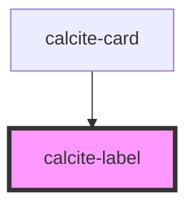

# calcite-label

Renders a `<label>` around its children and can be used with any [labelable native](https://developer.mozilla.org/en-US/docs/Web/Guide/HTML/Content_categories#Form_labelable) or labelable calcite element.

<!-- Auto Generated Below -->

## Usage

### Basic

It also allows consumers to set a `status` attribute for child `calcite-input` and `calcite-input-message` components to use to set their own properties.

```html
<calcite-label status="invalid">
  Invalid input
  <calcite-input type="search" placeholder="Filter your files" value="adfo2h2"></calcite-input>
  <calcite-input-message active icon> Something doesn't look right </calcite-input-message>
</calcite-label>
```

### Browser-caveat

When using the `default`, `inline` or `inline-space-between` layout option with [browsers that do not support the CSS `gap` property when used with flexbox](https://caniuse.com/flexbox-gap), you will need to use the `disable-spacing` attribute and apply spacing manually to the label by wrapping it in a styled span like so:

```html
<calcite-label layout="inline" disable-spacing>
  <span style="margin-right: 0.75rem">Text leading inline</span>
  <calcite-checkbox></calcite-checkbox>
</calcite-label>
```

## Properties

| Property         | Attribute         | Description                                                                                                                                                                                                                 | Type                                              | Default     |
| ---------------- | ----------------- | --------------------------------------------------------------------------------------------------------------------------------------------------------------------------------------------------------------------------- | ------------------------------------------------- | ----------- |
| `alignment`      | `alignment`       | Specifies the text alignment of the component.                                                                                                                                                                              | `"center" \| "end" \| "start"`                    | `"start"`   |
| `disableSpacing` | `disable-spacing` | <span style="color:red">**[DEPRECATED]**</span> Set the `--calcite-label-margin-bottom` css variable to `0` instead.<br/><br/>When true, disables the component's spacing.                                                  | `boolean`                                         | `false`     |
| `disabled`       | `disabled`        | <span style="color:red">**[DEPRECATED]**</span> Use the `disabled` property on the component the label is bound to instead.<br/><br/>When true, interaction is prevented and the component is displayed with lower opacity. | `boolean`                                         | `false`     |
| `for`            | `for`             | Specifies the `id` of the component the label is bound to. Use when the component the label is bound to does not reside within the component.                                                                               | `string`                                          | `undefined` |
| `layout`         | `layout`          | Defines the layout of the label in relation to the component. Use `"inline"` positions to wrap the label and component on the same line.                                                                                    | `"default" \| "inline" \| "inline-space-between"` | `"default"` |
| `scale`          | `scale`           | Specifies the size of the component.                                                                                                                                                                                        | `"l" \| "m" \| "s"`                               | `"m"`       |
| `status`         | `status`          | <span style="color:red">**[DEPRECATED]**</span> Set directly on the component the label is bound to instead.<br/><br/>Specifies the status of the component and any child input, or input messages.                         | `"idle" \| "invalid" \| "valid"`                  | `"idle"`    |

## Slots

| Slot | Description                                                 |
| ---- | ----------------------------------------------------------- |
|      | A slot for adding text and a component that can be labeled. |

## CSS Custom Properties

| Name                            | Description                      |
| ------------------------------- | -------------------------------- |
| `--calcite-label-margin-bottom` | The spacing below the component. |

## Dependencies

### Used by

- [calcite-card](../card)

### Graph



---

_Built with [StencilJS](https://stenciljs.com/)_
