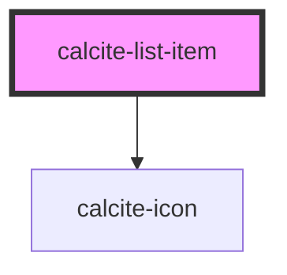

# calcite-list-item

A general purpose list that enables users to construct list items that conform to Calcite styling.

If you are looking for a list that handles more advanced usage like selection, see the documentation for 'calcite-pick-list' or 'calcite-value-list'.

<!-- Auto Generated Below -->

## Properties

| Property      | Attribute     | Description                                                                                              | Type                        | Default     |
| ------------- | ------------- | -------------------------------------------------------------------------------------------------------- | --------------------------- | ----------- |
| `description` | `description` | A description for the component. Displays below the label text.                                          | `string`                    | `undefined` |
| `disabled`    | `disabled`    | When `true`, interaction is prevented and the component is displayed with lower opacity.                 | `boolean`                   | `false`     |
| `label`       | `label`       | The label text of the component. Displays above the description text.                                    | `string`                    | `undefined` |
| `metadata`    | --            | Provides additional metadata to the component. Primary use is for a filter on the parent `calcite-list`. | `{ [x: string]: unknown; }` | `undefined` |
| `open`        | `open`        | When `true`, the item is open to show child components.                                                  | `boolean`                   | `false`     |
| `selected`    | `selected`    | When `true`, the component is selected.                                                                  | `boolean`                   | `false`     |
| `value`       | `value`       | The component's value.                                                                                   | `any`                       | `undefined` |

## Events

| Event                   | Description                                | Type                |
| ----------------------- | ------------------------------------------ | ------------------- |
| `calciteListItemSelect` | Emits when the item's content is selected. | `CustomEvent<void>` |

## Methods

### `setFocus() => Promise<void>`

Sets focus on the component.

#### Returns

Type: `Promise<void>`

## Slots

| Slot              | Description                                                                                                    |
| ----------------- | -------------------------------------------------------------------------------------------------------------- |
|                   | A slot for adding `calcite-list-item` and `calcite-list-item-group` elements.                                  |
| `"actions-end"`   | A slot for adding actionable `calcite-action` elements after the content of the component.                     |
| `"actions-start"` | A slot for adding actionable `calcite-action` elements before the content of the component.                    |
| `"content"`       | A slot for adding non-actionable, centered content in place of the `label` and `description` of the component. |
| `"content-end"`   | A slot for adding non-actionable elements after the label and description of the component.                    |
| `"content-start"` | A slot for adding non-actionable elements before the label and description of the component.                   |

## Dependencies

### Depends on

- [calcite-icon](../icon)

### Graph

---

_Built with [StencilJS](https://stenciljs.com/)_
