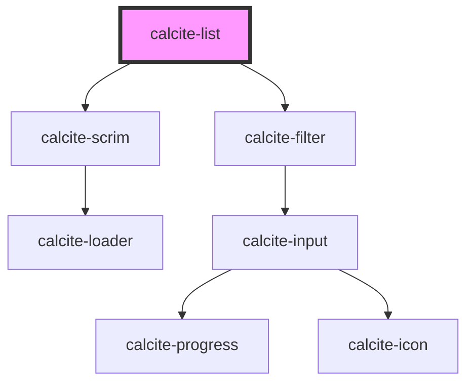

# calcite-list

<!-- Auto Generated Below -->

## Overview

A general purpose list that enables users to construct list items that conform to Calcite styling.

## Usage

### Advanced

```html
<calcite-list>
  <calcite-list-item label="Princess Bubblegum" description="Ruler of The Candy Kingdom">
    <calcite-action icon="drag" label="drag" scale="s" slot="actions-start"></calcite-action>
    <calcite-icon scale="l" icon="effects" slot="content-start"></calcite-icon>
    <calcite-avatar
      scale="l"
      slot="content-start"
      thumbnail="https://slm-assets.secondlife.com/assets/19947929/view_large/Capture_du_2018-03-04_20-40-56.jpg?1520192584"
    ></calcite-avatar>
    <calcite-icon scale="s" icon="check" slot="content-end" style="color: var(--calcite-ui-success)"></calcite-icon>
    <calcite-action icon="ellipsis" label="menu" slot="actions-end"></calcite-action>
    <calcite-action icon="x" label="remove" slot="actions-end"></calcite-action>
  </calcite-list-item>
  <calcite-list-item label="Finn Mertens" description="Part owner of the Tree House">
    <calcite-action icon="drag" label="drag" scale="s" slot="actions-start"></calcite-action>
    <calcite-icon scale="l" icon="running" slot="content-start"></calcite-icon>
    <calcite-avatar
      scale="l"
      slot="content-start"
      thumbnail="https://www.seekpng.com/png/detail/90-906849_89kib-1024x631-finn-finn-adventure-time-face.png"
    ></calcite-avatar>
    <calcite-icon scale="s" icon="check" slot="content-end" style="color: var(--calcite-ui-success)"></calcite-icon>
    <calcite-action icon="ellipsis" label="menu" slot="actions-end"></calcite-action>
    <calcite-action icon="x" label="remove" slot="actions-end"></calcite-action>
  </calcite-list-item>
  <calcite-list-item label="Jake T. Dog" description="Part owner of the Tree House">
    <calcite-action icon="drag" label="drag" scale="s" slot="actions-start"></calcite-action>
    <calcite-icon scale="l" icon="walking" slot="content-start"></calcite-icon>
    <calcite-avatar
      scale="l"
      slot="content-start"
      thumbnail="https://static.wikia.nocookie.net/adventuretimewithfinnandjake/images/c/c9/603138_454321168018988_647044807_n.png/revision/latest/scale-to-width-down/250?cb=20140624024310"
    ></calcite-avatar>
    <calcite-icon
      scale="s"
      icon="exclamation-mark-triangle"
      slot="content-end"
      style="color: var(--calcite-ui-danger)"
    ></calcite-icon>
    <calcite-action icon="ellipsis" label="menu" slot="actions-end"></calcite-action>
    <calcite-action icon="x" label="remove" slot="actions-end"></calcite-action>
  </calcite-list-item>
</calcite-list>
```

### Basic

```html
<calcite-list>
  <calcite-list-item
    label="Cras iaculis ultricies nulla."
    description="Lorem ipsum dolor sit amet, consectetuer adipiscing elit."
  ></calcite-list-item>
  <calcite-list-item
    label="Ut aliquam sollicitudin leo."
    description="Aliquam tincidunt mauris eu risus."
  ></calcite-list-item>
  <calcite-list-item
    label="Vestibulum commodo felis quis tortor.
  "
    description="Vestibulum auctor dapibus neque.
  "
  ></calcite-list-item>
</calcite-list>
```

### Grouped

```html
<calcite-list>
  <calcite-list-item-group heading="Digits">
    <calcite-list-item
      label="One"
      description="Lorem ipsum dolor sit amet, consectetuer adipiscing elit."
    ></calcite-list-item>
    <calcite-list-item label="Two" description="Aliquam tincidunt mauris eu risus."></calcite-list-item>
    <calcite-list-item label="Three" description="Vestibulum auctor dapibus neque."></calcite-list-item>
  </calcite-list-item-group>
  <calcite-list-item-group heading="Letters">
    <calcite-list-item
      label="A"
      description="Lorem ipsum dolor sit amet, consectetuer adipiscing elit."
    ></calcite-list-item>
    <calcite-list-item label="B" description="Aliquam tincidunt mauris eu risus."></calcite-list-item>
    <calcite-list-item
      label="C"
      description="Lorem ipsum dolor sit amet, consectetuer adipiscing elit."
    ></calcite-list-item>
  </calcite-list-item-group>
</calcite-list>
```

### Nested

```html
<calcite-list>
  <calcite-list-item
    label="Cras iaculis ultricies nulla."
    description="Lorem ipsum dolor sit amet, consectetuer adipiscing elit."
  >
    <calcite-list-item label="Ut aliquam sollicitudin leo." description="Aliquam tincidunt mauris eu risus.">
      <calcite-list-item
        label="Vestibulum commodo felis quis tortor."
        description="Vestibulum auctor dapibus neque."
      ></calcite-list-item></calcite-list-item
  ></calcite-list-item>
</calcite-list>
```

## Properties

| Property              | Attribute              | Description                                                                                                                                                                                                                     | Type                                                                                          | Default     |
| --------------------- | ---------------------- | ------------------------------------------------------------------------------------------------------------------------------------------------------------------------------------------------------------------------------- | --------------------------------------------------------------------------------------------- | ----------- |
| `disabled`            | `disabled`             | When `true`, interaction is prevented and the component is displayed with lower opacity.                                                                                                                                        | `boolean`                                                                                     | `false`     |
| `filterEnabled`       | `filter-enabled`       | When `true`, an input appears at the top of the component that can be used by end users to filter `calcite-list-item`s.                                                                                                         | `boolean`                                                                                     | `false`     |
| `filterPlaceholder`   | `filter-placeholder`   | Placeholder text for the component's filter input field.                                                                                                                                                                        | `string`                                                                                      | `undefined` |
| `filterText`          | `filter-text`          | Text for the component's filter input field.                                                                                                                                                                                    | `string`                                                                                      | `undefined` |
| `filteredData`        | --                     | The currently filtered `calcite-list-item` data.                                                                                                                                                                                | `{ label: string; description: string; metadata: Record<string, unknown>; value: string; }[]` | `[]`        |
| `filteredItems`       | --                     | The currently filtered `calcite-list-item`s.                                                                                                                                                                                    | `HTMLCalciteListItemElement[]`                                                                | `[]`        |
| `label`               | `label`                | Specifies an accessible name for the component.                                                                                                                                                                                 | `string`                                                                                      | `undefined` |
| `loading`             | `loading`              | When `true`, a busy indicator is displayed.                                                                                                                                                                                     | `boolean`                                                                                     | `false`     |
| `selectedItems`       | --                     | The currently selected items.                                                                                                                                                                                                   | `HTMLCalciteListItemElement[]`                                                                | `[]`        |
| `selectionAppearance` | `selection-appearance` | Specifies the selection appearance - `"icon"` (displays a checkmark or dot) or `"border"` (displays a border).                                                                                                                  | `"border" \| "icon"`                                                                          | `"icon"`    |
| `selectionMode`       | `selection-mode`       | Specifies the selection mode - `"multiple"` (allow any number of selected items), `"single"` (allow one selected item), `"single-persist"` (allow one selected item and prevent de-selection), or `"none"` (no selected items). | `"multiple" \| "none" \| "single" \| "single-persist"`                                        | `"none"`    |

## Events

| Event               | Description                                              | Type                |
| ------------------- | -------------------------------------------------------- | ------------------- |
| `calciteListChange` | Emits when any of the list item selections have changed. | `CustomEvent<void>` |
| `calciteListFilter` | Emits when the component's filter has changed.           | `CustomEvent<void>` |

## Methods

### `setFocus() => Promise<void>`

Sets focus on the component's first focusable element.

#### Returns

Type: `Promise<void>`

## Slots

| Slot | Description                                     |
| ---- | ----------------------------------------------- |
|      | A slot for adding `calcite-list-item` elements. |

## Dependencies

### Depends on

- [calcite-scrim](../scrim)
- [calcite-filter](../filter)

### Graph



---

_Built with [StencilJS](https://stenciljs.com/)_
