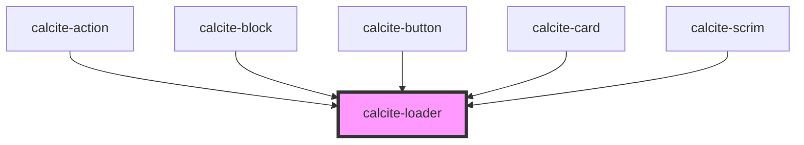

# calcite-loader

The `calcite-loader` component can act as a determinate or indeterminate loading indicator.

<!-- Auto Generated Below -->

## Usage

### Basic

You can use the `active` attribute to toggle visibility:

```html
<calcite-loader text="Fetching data..." active></calcite-loader>
```

### Compact

For instances when you don't have room for the full loader, you can use the smaller `inline` version of the loader. The inline version is meant to sit to the left of text:

```html
<p><calcite-loader active inline></calcite-loader> Inline loader</p>
```

### Determinate

If you can calculate your progress, it's best to use the determinate version of the loader. Update the `value` of the element when progress is made. This will display a progress bar along the perimeter of the loader showing 32% complete:

```html
<calcite-loader type="determinate" value="32" active></calcite-loader>
```

## Properties

| Property             | Attribute    | Description                                                                                                                                          | Type                               | Default     |
| -------------------- | ------------ | ---------------------------------------------------------------------------------------------------------------------------------------------------- | ---------------------------------- | ----------- |
| `active`             | `active`     | When true, the component is active.                                                                                                                  | `boolean`                          | `false`     |
| `inline`             | `inline`     | When true, displays smaller and appears to the left of the text.                                                                                     | `boolean`                          | `false`     |
| `label` _(required)_ | `label`      | Accessible name for the component.                                                                                                                   | `string`                           | `undefined` |
| `noPadding`          | `no-padding` | <span style="color:red">**[DEPRECATED]**</span> Use `--calcite-loader-padding` CSS variable instead.<br/><br/>Disables spacing around the component. | `boolean`                          | `false`     |
| `scale`              | `scale`      | Specifies the size of the component.                                                                                                                 | `"l" \| "m" \| "s"`                | `"m"`       |
| `text`               | `text`       | Text that displays under the component's indicator.                                                                                                  | `string`                           | `""`        |
| `type`               | `type`       | Use indeterminate if finding actual progress value is impossible.                                                                                    | `"determinate" \| "indeterminate"` | `undefined` |
| `value`              | `value`      | The component's value. Valid only for determinate indicators. Percent complete of 100.                                                               | `number`                           | `0`         |

## CSS Custom Properties

| Name                           | Description                                                          |
| ------------------------------ | -------------------------------------------------------------------- |
| `--calcite-loader-font-size`   | When type is "determinate", the font size of the loading percentage. |
| `--calcite-loader-size`        | The width and height of a non-inline loader.                         |
| `--calcite-loader-size-inline` | The width and height of an inline loader.                            |

## Dependencies

### Used by

- [calcite-action](../action)
- [calcite-block](../block)
- [calcite-button](../button)
- [calcite-card](../card)
- [calcite-scrim](../scrim)

### Graph



---

_Built with [StencilJS](https://stenciljs.com/)_
