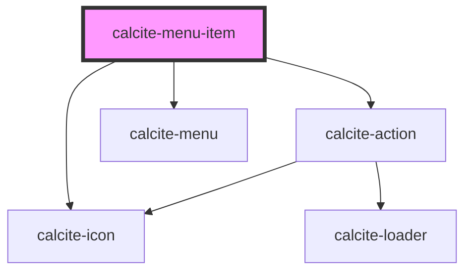

# calcite-nav-menu-item

<!-- Auto Generated Below -->

## Usage

### Basic

```html
<calcite-menu> <calcite-menu-item id="Nature" text="Nature"> </calcite-menu-item></calcite-menu>
```

### Nested-With-Href

Nested SubMenu with href.

```html
<calcite-menu>
  <calcite-menu-item id="Nature" text="Nature" href="#">
    <calcite-menu-item id="Mountains" text="Mountains" slot="submenu-item"> </calcite-menu-item>
  </calcite-menu-item>
</calcite-menu>
```

## Properties

| Property             | Attribute       | Description                                                                                                 | Type                         | Default     |
| -------------------- | --------------- | ----------------------------------------------------------------------------------------------------------- | ---------------------------- | ----------- |
| `active`             | `active`        | When `true`, the component is highlighted.                                                                  | `boolean`                    | `undefined` |
| `breadcrumb`         | `breadcrumb`    | When true, the component displays a visual indication of breadcrumb                                         | `boolean`                    | `undefined` |
| `href`               | `href`          | Specifies the URL destination of the component, which can be set as an absolute or relative path.           | `string`                     | `undefined` |
| `iconEnd`            | `icon-end`      | Specifies an icon to display at the end of the component.                                                   | `string`                     | `undefined` |
| `iconFlipRtl`        | `icon-flip-rtl` | Displays the `iconStart` and/or `iconEnd` as flipped when the element direction is right-to-left (`"rtl"`). | `"both" \| "end" \| "start"` | `undefined` |
| `iconStart`          | `icon-start`    | Specifies an icon to display at the start of the component.                                                 | `string`                     | `undefined` |
| `label` _(required)_ | `label`         | Specifices accessible name for the component.                                                               | `string`                     | `undefined` |
| `open`               | `open`          | /_ When true, the menu item will display any slotted `calcite-menu-item` in an open overflow menu _         | `boolean`                    | `false`     |
| `rel`                | `rel`           | Defines the relationship between the `href` value and the current document.                                 | `string`                     | `undefined` |
| `target`             | `target`        | Specifies where to open the linked document defined in the `href` property.                                 | `string`                     | `undefined` |
| `text`               | `text`          | Specifies the text to display.                                                                              | `string`                     | `undefined` |

## Events

| Event                   | Description                            | Type                |
| ----------------------- | -------------------------------------- | ------------------- |
| `calciteMenuItemSelect` | Emits when user selects the component. | `CustomEvent<void>` |

## Methods

### `setFocus() => Promise<void>`

Sets focus on the component.

#### Returns

Type: `Promise<void>`

## Dependencies

### Depends on

- [calcite-icon](../icon)
- [calcite-action](../action)
- [calcite-menu](../menu)

### Graph



---

_Built with [StencilJS](https://stenciljs.com/)_
