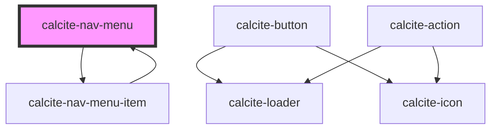

# calcite-nav-menu

<!-- Auto Generated Below -->

## Properties

| Property            | Attribute             | Description | Type                         | Default     |
| ------------------- | --------------------- | ----------- | ---------------------------- | ----------- |
| `collapsed`         | `collapsed`           |             | `any`                        | `undefined` |
| `disableCollapse`   | `disable-collapse`    |             | `any`                        | `undefined` |
| `layout`            | `layout`              |             | `"horizontal" \| "vertical"` | `undefined` |
| `minCollapsedItems` | `min-collapsed-items` |             | `any`                        | `undefined` |

## Dependencies

### Used by

- [calcite-nav-menu-item](../nav-menu-item)

### Depends on

- [calcite-nav-menu-item](../nav-menu-item)

### Graph

---

_Built with [StencilJS](https://stenciljs.com/)_
