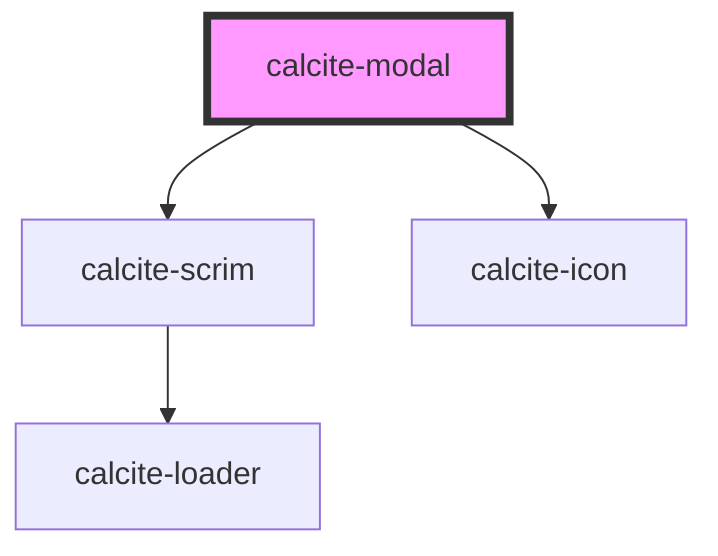

# calcite-modal

`calcite-modal` allows you to show a modal/dialog to your users. The modal handles fencing focus and animating in/out.

<style>
  html {
      overflow:auto !important;
  }
</style>
<!-- Auto Generated Below -->

## Usage

### Basic

Customize the modal by passing your content into multiple named slots: `header` (title-area of the modal), `content` (main body of the modal), and up to three modal actions: primary, secondary, and back. Notice below we use the `aria-labelledby` attribute, relating it to the title of the modal. In order to ensure good accessibility, it's recommended that you use either an `aria-label` or `aria-labelledby` attribute so screen readers can infer what the subject matter of your modal is.

```html
<calcite-modal aria-labelledby="modal-title" open>
  <h3 slot="header" id="modal-title">Title of the modal</h3>
  <div slot="content">The actual content of the modal</div>
  <calcite-button slot="back" color="neutral" appearance="outline" icon="chevron-left" width="full">
    Back
  </calcite-button>
  <calcite-button slot="secondary" width="full" appearance="outline"> Cancel </calcite-button>
  <calcite-button slot="primary" width="full"> Save </calcite-button>
</calcite-modal>
```

### Open

To open a modal, add the `active` prop. Once the opening animation is complete, the `calciteModalOpen` event will be fired.

To close the modal, simply remove the attribute. This will run your before close method (if provided, see below) and fire the `calciteModalClose` event after the animation and teardown is complete.

```html
<calcite-modal open></calcite-modal>
```

### Reacting-before-close

If you'd like to perform some actions prior to closing (ie. warning users they will lose their changes) you can pass a function to the `beforeClose` property. This method will be called prior to close and should return a [`Promise`](https://developer.mozilla.org/en-US/docs/Web/JavaScript/Reference/Global_Objects/Promise):

```js
function beforeClose() {
  return new Promise((resolve) => {
    // do something async
    resolve(); // this will trigger the close animation
  });
}

const modal = document.getElementById("my-modal");
modal.beforeClose = beforeClose;
```

## Properties

| Property               | Attribute                | Description                                                                                                                                                                                                  | Type                                 | Default                   |
| ---------------------- | ------------------------ | ------------------------------------------------------------------------------------------------------------------------------------------------------------------------------------------------------------ | ------------------------------------ | ------------------------- |
| `backgroundColor`      | `background-color`       | Sets the background color of the component's content.                                                                                                                                                        | `"grey" \| "white"`                  | `"white"`                 |
| `beforeClose`          | --                       | Passes a function to run before the component closes.                                                                                                                                                        | `(el: HTMLElement) => Promise<void>` | `() => Promise.resolve()` |
| `closeButtonDisabled`  | `close-button-disabled`  | When `true`, disables the component's close button.                                                                                                                                                          | `boolean`                            | `false`                   |
| `color`                | `color`                  | Adds a color bar to the top of component for visual impact. Use color to add importance to destructive or workflow dialogs.                                                                                  | `"blue" \| "red"`                    | `undefined`               |
| `docked`               | `docked`                 | When `true`, prevents the component from expanding to the entire screen on mobile devices.                                                                                                                   | `boolean`                            | `undefined`               |
| `escapeDisabled`       | `escape-disabled`        | When `true`, disables the default close on escape behavior.                                                                                                                                                  | `boolean`                            | `false`                   |
| `focusTrapDisabled`    | `focus-trap-disabled`    | When `true`, prevents focus trapping.                                                                                                                                                                        | `boolean`                            | `false`                   |
| `fullscreen`           | `fullscreen`             | Sets the component to always be fullscreen (overrides `width`).                                                                                                                                              | `boolean`                            | `undefined`               |
| `intlClose`            | `intl-close`             | <span style="color:red">**[DEPRECATED]**</span> – translations are now built-in, if you need to override a string, please use `messageOverrides`.<br/><br/>Accessible name for the component's close button. | `string`                             | `undefined`               |
| `messageOverrides`     | `message-overrides`      | Use this property to override individual strings used by the component.                                                                                                                                      | `Messages`                           | `undefined`               |
| `open`                 | `open`                   | When `true`, displays and positions the component.                                                                                                                                                           | `boolean`                            | `false`                   |
| `outsideCloseDisabled` | `outside-close-disabled` | When `true`, disables the closing of the component when clicked outside.                                                                                                                                     | `boolean`                            | `false`                   |
| `scale`                | `scale`                  | Specifies the size of the component.                                                                                                                                                                         | `"l" \| "m" \| "s"`                  | `"m"`                     |
| `width`                | `width`                  | Specifies the width of the component. Can use scale sizes or pass a number (displays in pixels).                                                                                                             | `"l" \| "m" \| "s" \| number`        | `"m"`                     |

## Events

| Event                     | Description                                                                                              | Type                |
| ------------------------- | -------------------------------------------------------------------------------------------------------- | ------------------- |
| `calciteModalBeforeClose` | Fires when the component is requested to be closed and before the closing transition begins.             | `CustomEvent<void>` |
| `calciteModalBeforeOpen`  | Fires when the component is added to the DOM but not rendered, and before the opening transition begins. | `CustomEvent<void>` |
| `calciteModalClose`       | Fires when the component is closed and animation is complete.                                            | `CustomEvent<void>` |
| `calciteModalOpen`        | Fires when the component is open and animation is complete.                                              | `CustomEvent<void>` |

## Methods

### `scrollContent(top?: number, left?: number) => Promise<void>`

Sets the scroll top of the component's content.

#### Returns

Type: `Promise<void>`

### `setFocus(focusId?: "close-button") => Promise<void>`

Sets focus on the component.

By default, tries to focus on focusable content. If there is none, it will focus on the close button.
To focus on the close button, use the `close-button` focus ID.

#### Returns

Type: `Promise<void>`

## Slots

| Slot          | Description                                |
| ------------- | ------------------------------------------ |
| `"back"`      | A slot for adding a back button.           |
| `"content"`   | A slot for adding the component's content. |
| `"header"`    | A slot for adding header text.             |
| `"primary"`   | A slot for adding a primary button.        |
| `"secondary"` | A slot for adding a secondary button.      |

## CSS Custom Properties

| Name                         | Description                                        |
| ---------------------------- | -------------------------------------------------- |
| `--calcite-modal-padding`    | Specifies the padding of the modal.                |
| `--calcite-scrim-background` | The component's semi-transparent background color. |

## Dependencies

### Depends on

- [calcite-scrim](../scrim)
- [calcite-icon](../icon)

### Graph



---

_Built with [StencilJS](https://stenciljs.com/)_
