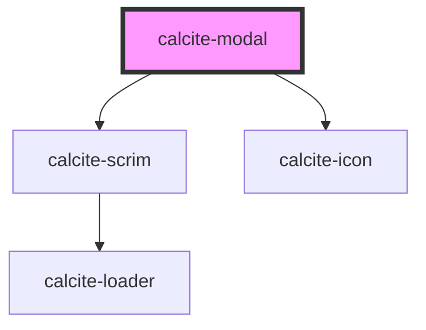

# calcite-modal

`calcite-modal` allows you to show a modal/dialog to your users. The modal handles fencing focus and animating in/out.

<style>
  html {
      overflow:auto !important;
  }
</style>
<!-- Auto Generated Below -->

## Usage

### Basic

Customize the modal by passing your content into multiple named slots: `header` (title-area of the modal), `content` (main body of the modal), and up to three modal actions: primary, secondary, and back. Notice below we use the `aria-labelledby` attribute, relating it to the title of the modal. In order to ensure good accessibility, it's recommended that you use either an `aria-label` or `aria-labelledby` attribute so screen readers can infer what the subject matter of your modal is.

```html
<calcite-modal aria-labelledby="modal-title" active>
  <h3 slot="header" id="modal-title">Title of the modal</h3>
  <div slot="content">The actual content of the modal</div>
  <calcite-button slot="back" color="neutral" appearance="outline" icon="chevron-left" width="full">
    Back
  </calcite-button>
  <calcite-button slot="secondary" width="full" appearance="outline"> Cancel </calcite-button>
  <calcite-button slot="primary" width="full"> Save </calcite-button>
</calcite-modal>
```

### Open

To open a modal, add the `active` prop. Once the opening animation is complete, the `calciteModalOpen` event will be fired.

To close the modal, simply remove the attribute. This will run your before close method (if provided, see below) and fire the `calciteModalClose` event after the animation and teardown is complete.

```html
<calcite-modal active></calcite-modal>
```

### Reacting-before-close

If you'd like to perform some actions prior to closing (ie. warning users they will lose their changes) you can pass a function to the `beforeClose` property. This method will be called prior to close and should return a [`Promise`](https://developer.mozilla.org/en-US/docs/Web/JavaScript/Reference/Global_Objects/Promise):

```js
function beforeClose() {
  return new Promise((resolve) => {
    // do something async
    resolve(); // this will trigger the close animation
  });
}

const modal = document.getElementById("my-modal");
modal.beforeClose = beforeClose;
```

## Properties

| Property              | Attribute               | Description                                                                                                                       | Type                                 | Default                   |
| --------------------- | ----------------------- | --------------------------------------------------------------------------------------------------------------------------------- | ------------------------------------ | ------------------------- |
| `active`              | `active`                | When true, the `calcite-modal` is active.                                                                                         | `boolean`                            | `false`                   |
| `backgroundColor`     | `background-color`      | Sets the background color of `calcite-modal` content.                                                                             | `"grey" \| "white"`                  | `"white"`                 |
| `beforeClose`         | --                      | Passes a function to run before the `calcite-modal` closes.                                                                       | `(el: HTMLElement) => Promise<void>` | `() => Promise.resolve()` |
| `color`               | `color`                 | Adds a color bar to the top of `calcite-modal` for visual impact. Use color to add importance to destructive or workflow dialogs. | `"blue" \| "red"`                    | `undefined`               |
| `disableCloseButton`  | `disable-close-button`  | When true, disables the close button within the `calcite-modal`.                                                                  | `boolean`                            | `false`                   |
| `disableEscape`       | `disable-escape`        | When true, disables the default close on escape behavior.                                                                         | `boolean`                            | `false`                   |
| `disableOutsideClose` | `disable-outside-close` | When true, disables the closing of the `calcite-modal` when clicked outside.                                                      | `boolean`                            | `false`                   |
| `docked`              | `docked`                | When true, prevents the `calcite-modal` from expanding to the entire screen on mobile devices.                                    | `boolean`                            | `undefined`               |
| `firstFocus`          | --                      | Specify the initial focus when the `calcite-modal` is first opened.                                                               | `HTMLElement`                        | `undefined`               |
| `fullscreen`          | `fullscreen`            | Set the `calcite-modal` to always be fullscreen (overrides width).                                                                | `boolean`                            | `undefined`               |
| `intlClose`           | `intl-close`            | Aria label for the close button.                                                                                                  | `string`                             | `TEXT.close`              |
| `noPadding`           | `no-padding`            | When true, disables spacing to the content area slot.                                                                             | `boolean`                            | `false`                   |
| `scale`               | `scale`                 | Specify the scale of `calcite-modal`.                                                                                             | `"l" \| "m" \| "s"`                  | `"m"`                     |
| `width`               | `width`                 | Set the width of the `calcite-modal`. Can use scale sizes or pass a number (displays in pixels).                                  | `"l" \| "m" \| "s" \| number`        | `"m"`                     |

## Events

| Event               | Description                                              | Type               |
| ------------------- | -------------------------------------------------------- | ------------------ |
| `calciteModalClose` | Emits when `calcite-modal` finishes the close animation. | `CustomEvent<any>` |
| `calciteModalOpen`  | Emits when `calcite-modal` finishes the open animation.  | `CustomEvent<any>` |

## Methods

### `focusElement(el?: HTMLElement) => Promise<void>`

<span style="color:red">**[DEPRECATED]**</span> use `setFocus` instead.<br/><br/>Focus the first interactive element.

#### Returns

Type: `Promise<void>`

### `scrollContent(top?: number, left?: number) => Promise<void>`

Set the scroll top of the `calcite-modal` content.

#### Returns

Type: `Promise<void>`

### `setFocus(focusId?: "close-button") => Promise<void>`

Sets focus on the component.

By default, tries to focus on focusable content. If there is none, it will focus on the close button.
To focus on the close button, use the `close-button` focus ID.

#### Returns

Type: `Promise<void>`

## Slots

| Slot          | Description                                 |
| ------------- | ------------------------------------------- |
| `"back"`      | A slot for adding a back button.            |
| `"content"`   | A slot for adding `calcite-modal` content.  |
| `"header"`    | A slot for adding a `calcite-modal` header. |
| `"primary"`   | A slot for adding a primary button.         |
| `"secondary"` | A slot for adding a secondary button.       |

## CSS Custom Properties

| Name                            | Description                                                       |
| ------------------------------- | ----------------------------------------------------------------- |
| `--calcite-modal-content-text`  | The `calcite-modal` content font size.                            |
| `--calcite-modal-padding`       | The top/bottom padding around items in the `calcite-modal`.       |
| `--calcite-modal-padding-large` | The left/right padding around items in the `calcite-modal`.       |
| `--calcite-modal-title-text`    | The `calcite-modal` title font size.                              |
| `--calcite-scrim-background`    | The semi-transparent background color behind the `calcite-modal`. |

## Dependencies

### Depends on

- [calcite-scrim](../scrim)
- [calcite-icon](../icon)

### Graph



---

_Built with [StencilJS](https://stenciljs.com/)_
