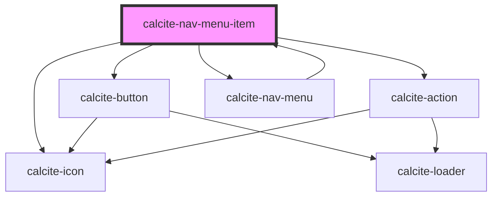

# calcite-nav-menu-item

<!-- Auto Generated Below -->

## Properties

| Property            | Attribute       | Description                                                                                                  | Type                         | Default        |
| ------------------- | --------------- | ------------------------------------------------------------------------------------------------------------ | ---------------------------- | -------------- |
| `active`            | `active`        | When `true`, the component is highlighted.                                                                   | `boolean`                    | `undefined`    |
| `breadcrumb`        | `breadcrumb`    | When true, the component displays a visual indication of breadcrumb                                          | `boolean`                    | `false`        |
| `editable`          | `editable`      | When true and `textEnabled` is true, the `text` will be user-editable, and the component will emit an event. | `boolean`                    | `undefined`    |
| `href`              | `href`          | When true, provide a navigable href link                                                                     | `any`                        | `undefined`    |
| `iconEnd`           | `icon-end`      | Specifies an icon to display at the end of the component.                                                    | `string`                     | `undefined`    |
| `iconFlipRtl`       | `icon-flip-rtl` | Displays the `iconStart` and/or `iconEnd` as flipped when the element direction is right-to-left (`"rtl"`).  | `"both" \| "end" \| "start"` | `undefined`    |
| `iconStart`         | `icon-start`    | Specifies an icon to display at the start of the component.                                                  | `string`                     | `undefined`    |
| `layout`            | `layout`        |                                                                                                              | `"horizontal" \| "vertical"` | `"horizontal"` |
| `rel`               | `rel`           | Defines the relationship between the `href` value and the current document.                                  | `string`                     | `undefined`    |
| `target`            | `target`        | Specifies where to open the linked document defined in the `href` property.                                  | `string`                     | `undefined`    |
| `text` _(required)_ | `text`          | Specifies the text the component displays                                                                    | `string`                     | `undefined`    |
| `textEnabled`       | `text-enabled`  | Displays the `text`                                                                                          | `boolean`                    | `undefined`    |

## Methods

### `setFocus() => Promise<void>`

Sets focus on the component.

#### Returns

Type: `Promise<void>`

## Dependencies

### Used by

- [calcite-nav-menu](../nav-menu)

### Depends on

- [calcite-icon](../icon)
- [calcite-button](../button)
- [calcite-action](../action)
- [calcite-nav-menu](../nav-menu)

### Graph

---

_Built with [StencilJS](https://stenciljs.com/)_
