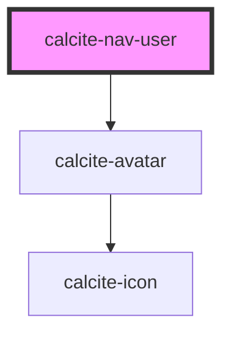

# calcite-nav-user

<!-- Auto Generated Below -->

## Properties

| Property      | Attribute      | Description                                                               | Type      | Default     |
| ------------- | -------------- | ------------------------------------------------------------------------- | --------- | ----------- |
| `active`      | `active`       | When `true`, visually highlight the component                             | `any`     | `undefined` |
| `src`         | `src`          | Specifies the image src to display                                        | `any`     | `undefined` |
| `subText`     | `sub-text`     | Specifies the subtext to display, for example a user organization or role | `string`  | `undefined` |
| `text`        | `text`         | Specifies the text to display, for example a user name or full name       | `string`  | `undefined` |
| `textEnabled` | `text-enabled` | When `true`, makes `text` and `subText` visible                           | `boolean` | `undefined` |

## Dependencies

### Depends on

- [calcite-avatar](../avatar)

### Graph

---

_Built with [StencilJS](https://stenciljs.com/)_
