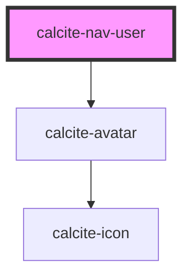

# calcite-nav-user

<!-- Auto Generated Below -->

## Properties

| Property    | Attribute   | Description                                                                                                | Type      | Default     |
| ----------- | ----------- | ---------------------------------------------------------------------------------------------------------- | --------- | ----------- |
| `active`    | `active`    | When `true`, visually highlight the component                                                              | `boolean` | `undefined` |
| `fullName`  | `full-name` | Specifies the text to display, for example a user name or full name                                        | `string`  | `undefined` |
| `hideText`  | `hide-text` | When `true`, hides the `fullName` and `username`.                                                          | `boolean` | `false`     |
| `label`     | `label`     | Specifies accesible label for the component                                                                | `string`  | `undefined` |
| `thumbnail` | `thumbnail` | Specifies the `src` to an image to display in the Avatar (remember to add a token if the user is private). | `string`  | `undefined` |
| `userId`    | `user-id`   | Specifies the unique id of the user.                                                                       | `string`  | `undefined` |
| `username`  | `username`  | Specifies the subtext to display, for example a user organization or role                                  | `string`  | `undefined` |

## Events

| Event                  | Description                           | Type                |
| ---------------------- | ------------------------------------- | ------------------- |
| `calciteNavUserSelect` | Emits when user select the component. | `CustomEvent<void>` |

## Dependencies

### Depends on

- [calcite-avatar](../avatar)

### Graph

---

_Built with [StencilJS](https://stenciljs.com/)_
