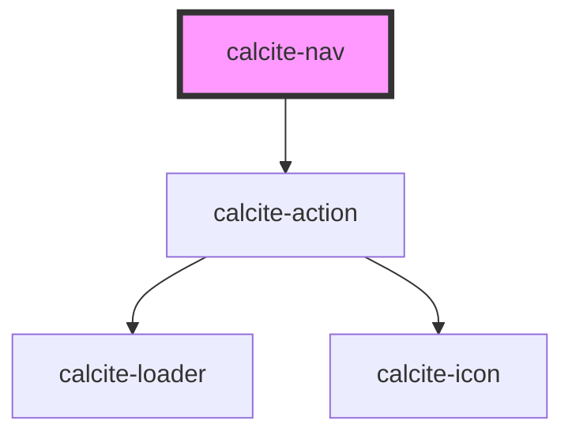

# calcite-nav

<!-- Auto Generated Below -->

## Properties

| Property             | Attribute             | Description                                                                                           | Type      | Default     |
| -------------------- | --------------------- | ----------------------------------------------------------------------------------------------------- | --------- | ----------- |
| `displayMenuAction`  | `display-menu-action` | When true, display a hamburger icon and emits `calciteNavMenuActionSelect` event on user interaction. | `boolean` | `false`     |
| `label` _(required)_ | `label`               | Specifies the label of the hamburger icon.                                                            | `string`  | `undefined` |

## Events

| Event                        | Description                                             | Type                |
| ---------------------------- | ------------------------------------------------------- | ------------------- |
| `calciteNavMenuActionSelect` | Emits whenever the component is selected or unselected. | `CustomEvent<void>` |

## CSS Custom Properties

| Name                                   | Description                                                 |
| -------------------------------------- | ----------------------------------------------------------- |
| `--calcite-nav-primary-background`     | Specifies the background color of the primary navigation.   |
| `--calcite-nav-primary-border-color`   | Specifies the background color of the primary navigation.   |
| `--calcite-nav-secondary-background`   | Specifies the background color of the secondary navigation. |
| `--calcite-nav-secondary-border-color` | Specifies the background color of the primary navigation.   |
| `--calcite-nav-tertiary-background`    | Specifies the width of the component.                       |
| `--calcite-nav-tertiary-border-color`  | Specifies the background color of the primary navigation.   |
| `--calcite-nav-width`                  | Specifies the width of the component's content area.        |

## Dependencies

### Depends on

- [calcite-action](../action)

### Graph

---

_Built with [StencilJS](https://stenciljs.com/)_
