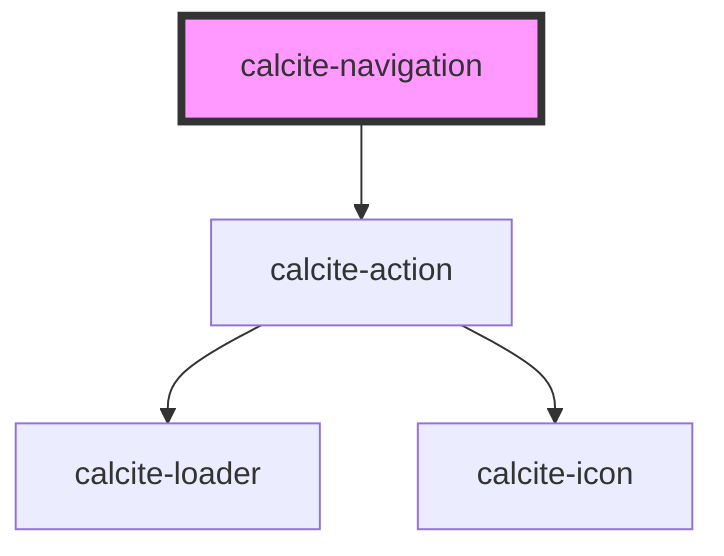

# calcite-navigation

<!-- Auto Generated Below -->

## Usage

### Basic

```html
<calcite-shell>
  <calcite-navigation slot="header">
    <calcite-chip-group slot="primary-content-center">
      <calcite-chip>nav item 1</calcite-chip>
      <calcite-chip>nav item 2</calcite-chip>
      <calcite-chip>nav item 3</calcite-chip>
    </calcite-chip-group>
  </calcite-navigation>
</calcite-shell>
```

## Properties

| Property             | Attribute           | Description                                                                                              | Type      | Default     |
| -------------------- | ------------------- | -------------------------------------------------------------------------------------------------------- | --------- | ----------- |
| `label` _(required)_ | `label`             | When `navigationAction` is `true`, specifies the label of the `calcite-action`.                          | `string`  | `undefined` |
| `navigationAction`   | `navigation-action` | When `true`, displays a `calcite-action` and emits a `calciteNavActionSelect` event on selection change. | `boolean` | `false`     |

## Events

| Event                           | Description                                                                       | Type                |
| ------------------------------- | --------------------------------------------------------------------------------- | ------------------- |
| `calciteNavigationActionSelect` | When navigationAction is true, emits when the displayed action selection changes. | `CustomEvent<void>` |

## CSS Custom Properties

| Name                                          | Description                                                 |
| --------------------------------------------- | ----------------------------------------------------------- |
| `--calcite-navigation-primary-background`     | Specifies the background color of the primary navigation.   |
| `--calcite-navigation-primary-border-color`   | Specifies the background color of the primary navigation.   |
| `--calcite-navigation-secondary-background`   | Specifies the background color of the secondary navigation. |
| `--calcite-navigation-secondary-border-color` | Specifies the background color of the primary navigation.   |
| `--calcite-navigation-tertiary-background`    | Specifies the width of the component.                       |
| `--calcite-navigation-tertiary-border-color`  | Specifies the background color of the primary navigation.   |
| `--calcite-navigation-width`                  | Specifies the width of the component's content area.        |

## Dependencies

### Depends on

- [calcite-action](../action)

### Graph



---

_Built with [StencilJS](https://stenciljs.com/)_
