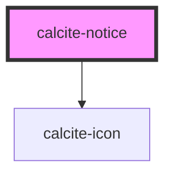

# calcite-notice

<!-- Auto Generated Below -->

## Usage

### Basic

```html
<calcite-notice scale="l" width="half" active>
  <div slot="title">Something failed</div>
  <div slot="message">That thing you wanted to do didn't work as expected</div>
  <calcite-link slot="link" href="/">View details</calcite-link>
  <calcite-action id="retry-action" slot="actions-end" title="Retry" icon="reset"></calcite-action>
</calcite-notice>
```

### Set-focus

You can programmatically focus the close button of a `dismissible` `calcite-notice` with the `setFocus()` method:

```html
<div onclick="document.querySelector('#my-notice').setFocus();">Focus!</div>
```

## Properties

| Property           | Attribute           | Description                                                                                                                                                                                      | Type                                     | Default     |
| ------------------ | ------------------- | ------------------------------------------------------------------------------------------------------------------------------------------------------------------------------------------------ | ---------------------------------------- | ----------- |
| `active`           | `active`            | <span style="color:red">**[DEPRECATED]**</span> Use `open` instead.<br/><br/>When `true`, the component is active.                                                                               | `boolean`                                | `false`     |
| `closable`         | `closable`          | When `true`, a close button is added to the component.                                                                                                                                           | `boolean`                                | `false`     |
| `color`            | `color`             | The color for the component's top border and icon.                                                                                                                                               | `"blue" \| "green" \| "red" \| "yellow"` | `"blue"`    |
| `dismissible`      | `dismissible`       | <span style="color:red">**[DEPRECATED]**</span> use `closable` instead.<br/><br/>When `true`, a close button is added to the component.                                                          | `boolean`                                | `false`     |
| `icon`             | `icon`              | When `true`, shows a default recommended icon. Alternatively, pass a Calcite UI Icon name to display a specific icon.                                                                            | `boolean \| string`                      | `undefined` |
| `intlClose`        | `intl-close`        | <span style="color:red">**[DEPRECATED]**</span> – translations are now built-in, if you need to override a string, please use `messageOverrides`.<br/><br/>Accessible name for the close button. | `string`                                 | `undefined` |
| `messageOverrides` | `message-overrides` | Use this property to override individual strings used by the component.                                                                                                                          | `Messages`                               | `undefined` |
| `open`             | `open`              | When `true`, the component is visible.                                                                                                                                                           | `boolean`                                | `false`     |
| `scale`            | `scale`             | Specifies the size of the component.                                                                                                                                                             | `"l" \| "m" \| "s"`                      | `"m"`       |
| `width`            | `width`             | Specifies the width of the component.                                                                                                                                                            | `"auto" \| "full" \| "half"`             | `"auto"`    |

## Events

| Event                | Description                         | Type                |
| -------------------- | ----------------------------------- | ------------------- |
| `calciteNoticeClose` | Fired when the component is closed. | `CustomEvent<void>` |
| `calciteNoticeOpen`  | Fired when the component is opened. | `CustomEvent<void>` |

## Methods

### `setFocus() => Promise<void>`

Sets focus on the component.

#### Returns

Type: `Promise<void>`

## Slots

| Slot            | Description                                                                                          |
| --------------- | ---------------------------------------------------------------------------------------------------- |
| `"actions-end"` | A slot for adding actions to the end of the component. It is recommended to use two or less actions. |
| `"link"`        | A slot for adding actions to take, such as: undo, try again, link to page, etc.                      |
| `"message"`     | A slot for adding the message.                                                                       |
| `"title"`       | A slot for adding the title.                                                                         |

## CSS Custom Properties

| Name                     | Description                 |
| ------------------------ | --------------------------- |
| `--calcite-notice-width` | The width of the component. |

## Dependencies

### Depends on

- [calcite-icon](../icon)

### Graph



---

_Built with [StencilJS](https://stenciljs.com/)_
