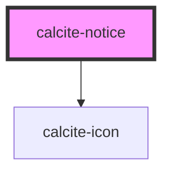

# calcite-notice

<!-- Auto Generated Below -->

## Usage

### Basic

```html
<calcite-notice scale="l" width="half" active>
  <div slot="title">Something failed</div>
  <div slot="message">That thing you wanted to do didn't work as expected</div>
  <calcite-link slot="link" href="/">View details</calcite-link>
  <calcite-action id="retry-action" slot="actions-end" title="Retry" icon="reset"></calcite-action>
</calcite-notice>
```

### Set-focus

You can programmatically focus the close button of a `dismissible` `calcite-notice` with the `setFocus()` method:

```html
<div onclick="document.querySelector('#my-notice').setFocus();">Focus!</div>
```

## Properties

| Property      | Attribute     | Description                                                                                                           | Type                                     | Default      |
| ------------- | ------------- | --------------------------------------------------------------------------------------------------------------------- | ---------------------------------------- | ------------ |
| `active`      | `active`      | When true, the `calcite-notice` is active.                                                                            | `boolean`                                | `false`      |
| `color`       | `color`       | The color for the `calcite-notice`. Color will apply to top border and icon.                                          | `"blue" \| "green" \| "red" \| "yellow"` | `"blue"`     |
| `dismissible` | `dismissible` | Shows a button the user can click to dismiss the `calcite-notice`.                                                    | `boolean`                                | `false`      |
| `icon`        | `icon`        | When present, shows a default recommended icon. You can also pass a calcite-ui-icon name to display a requested icon. | `boolean \| string`                      | `undefined`  |
| `intlClose`   | `intl-close`  | Accessible label for the close button.                                                                                | `string`                                 | `TEXT.close` |
| `scale`       | `scale`       | Specify the scale of `calcite-notice`.                                                                                | `"l" \| "m" \| "s"`                      | `"m"`        |
| `width`       | `width`       | Specify the width of the `calcite-notice`.                                                                            | `"auto" \| "full" \| "half"`             | `"auto"`     |

## Events

| Event                | Description                            | Type               |
| -------------------- | -------------------------------------- | ------------------ |
| `calciteNoticeClose` | Fired when `calcite-notice` is closed. | `CustomEvent<any>` |
| `calciteNoticeOpen`  | Fired when `calcite-notice` is opened. | `CustomEvent<any>` |

## Methods

### `setFocus() => Promise<void>`

Sets focus on the `calcite-notice`.

#### Returns

Type: `Promise<void>`

## Slots

| Slot            | Description                                                                                                            |
| --------------- | ---------------------------------------------------------------------------------------------------------------------- |
| `"actions-end"` | A slot for adding actions to the end of the `calcite-notice` (optional). It is recommended to use two or less actions. |
| `"link"`        | A slot for adding actions to take, such as: undo, try again, link to page, etc. (optional).                            |
| `"message"`     | A slot for adding the message.                                                                                         |
| `"title"`       | A slot for adding the title (optional).                                                                                |

## CSS Custom Properties

| Name                     | Description                    |
| ------------------------ | ------------------------------ |
| `--calcite-notice-width` | The width of `calcite-notice`. |

## Dependencies

### Depends on

- [calcite-icon](../icon)

### Graph



---

_Built with [StencilJS](https://stenciljs.com/)_
