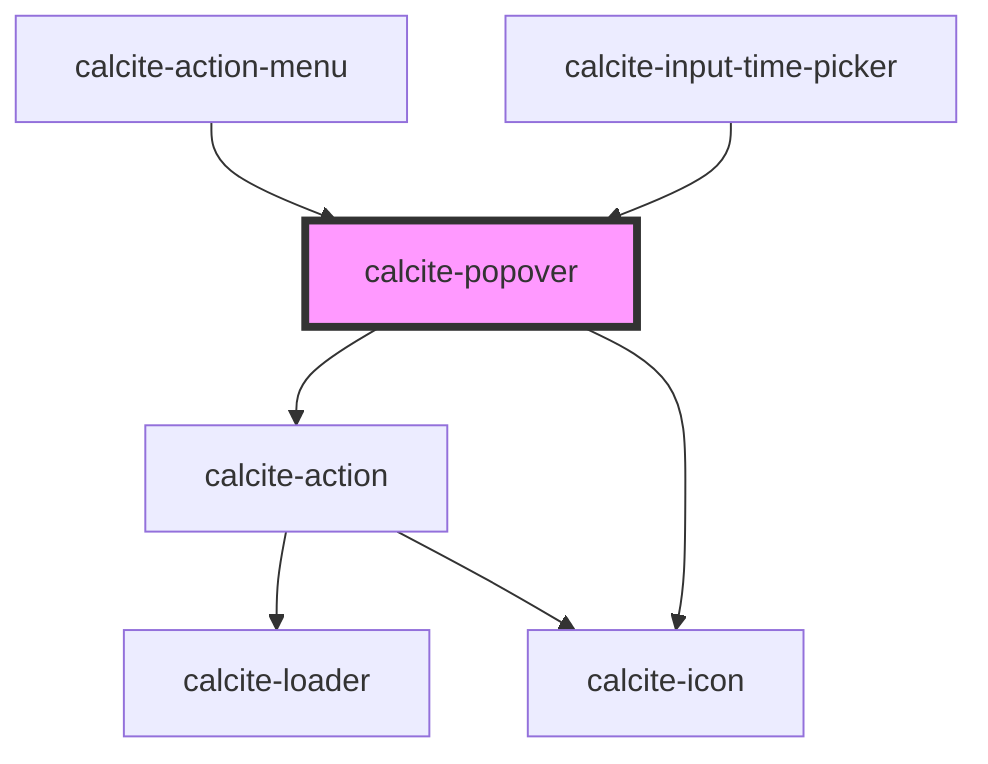

# calcite-popover

<!-- Auto Generated Below -->

## Usage

### Basic

```html
<calcite-popover reference-element="popover-button">Hello! I am some popover content!</calcite-popover>

<calcite-button id="popover-button">Clickable popover</calcite-button>
```

### Virtual

```html
<!-- virtually positioned popover -->
<calcite-popover id="virtual-popover" label="Hello world!" open>
  <p>Hello! I am some virtual popover content!</p>
</calcite-popover>

<script>
  function generateGetBoundingClientRect() {
    return () => ({
      width: 0,
      height: 0,
      top: 100,
      right: 100,
      bottom: 100,
      left: 600
    });
  }

  const virtualElement = {
    getBoundingClientRect: generateGetBoundingClientRect()
  };

  const popover = document.getElementById("virtual-popover");
  popover.referenceElement = virtualElement;
</script>
```

## Properties

| Property                        | Attribute             | Description                                                                                                                                                                                                                                           | Type                                                                                                       | Default                   |
| ------------------------------- | --------------------- | ----------------------------------------------------------------------------------------------------------------------------------------------------------------------------------------------------------------------------------------------------- | ---------------------------------------------------------------------------------------------------------- | ------------------------- |
| `autoClose`                     | `auto-close`          | When true and clicking outside of the component, automatically closes open `calcite-popover`s.                                                                                                                                                        | `boolean`                                                                                                  | `false`                   |
| `closeButton`                   | `close-button`        | <span style="color:red">**[DEPRECATED]**</span> use dismissible instead.<br/><br/>When true, a close button is added to the component.                                                                                                                | `boolean`                                                                                                  | `false`                   |
| `disableFlip`                   | `disable-flip`        | When true, prevents flipping the component's placement when overlapping its `referenceElement`.                                                                                                                                                       | `boolean`                                                                                                  | `false`                   |
| `disablePointer`                | `disable-pointer`     | When true, removes the caret pointer.                                                                                                                                                                                                                 | `boolean`                                                                                                  | `false`                   |
| `dismissible`                   | `dismissible`         | When true, a close button is added to the component.                                                                                                                                                                                                  | `boolean`                                                                                                  | `false`                   |
| `flipPlacements`                | --                    | Defines the available placements that can be used when a flip occurs.                                                                                                                                                                                 | `ComputedPlacement[]`                                                                                      | `undefined`               |
| `heading`                       | `heading`             | The component header text.                                                                                                                                                                                                                            | `string`                                                                                                   | `undefined`               |
| `headingLevel`                  | `heading-level`       | Specifies the number at which section headings should start.                                                                                                                                                                                          | `1 \| 2 \| 3 \| 4 \| 5 \| 6`                                                                               | `undefined`               |
| `intlClose`                     | `intl-close`          | Accessible name for the component's close button.                                                                                                                                                                                                     | `string`                                                                                                   | `TEXT.close`              |
| `label` _(required)_            | `label`               | Accessible name for the component.                                                                                                                                                                                                                    | `string`                                                                                                   | `undefined`               |
| `offsetDistance`                | `offset-distance`     | Offsets the position of the popover away from the `referenceElement`.                                                                                                                                                                                 | `number`                                                                                                   | `defaultOffsetDistance`   |
| `offsetSkidding`                | `offset-skidding`     | Offsets the position of the popover along the `referenceElement`.                                                                                                                                                                                     | `number`                                                                                                   | `0`                       |
| `open`                          | `open`                | When true, displays and positions the component.                                                                                                                                                                                                      | `boolean`                                                                                                  | `false`                   |
| `overlayPositioning`            | `overlay-positioning` | Describes the positioning type to use for the overlaid content. If the element is in a fixed container, use the "fixed" value.                                                                                                                        | `"absolute" \| "fixed"`                                                                                    | `"absolute"`              |
| `placement`                     | `placement`           | Determines where the component will be positioned relative to the `referenceElement`.                                                                                                                                                                 | `Placement \| PlacementRtl \| VariationRtl`                                                                | `defaultPopoverPlacement` |
| `referenceElement` _(required)_ | `reference-element`   | The `referenceElement` used to position the component according to its "placement" value. Setting to an `HTMLElement` is preferred so the component does not need to query the DOM. However, a string `id` of the reference element can also be used. | `Element \| string \| ({ getBoundingClientRect: () => ClientRect \| DOMRect; contextElement?: Element; })` | `undefined`               |
| `triggerDisabled`               | `trigger-disabled`    | When true, disables automatically toggling the component when its `referenceElement` has been triggered. This property can be set to "true" to manage when a popover is open.                                                                         | `boolean`                                                                                                  | `false`                   |

## Events

| Event                 | Description                         | Type               |
| --------------------- | ----------------------------------- | ------------------ |
| `calcitePopoverClose` | Fired when the component is closed. | `CustomEvent<any>` |
| `calcitePopoverOpen`  | Fired when the component is opened. | `CustomEvent<any>` |

## Methods

### `reposition() => Promise<void>`

Updates the position of the component.

#### Returns

Type: `Promise<void>`

### `setFocus(focusId?: "close-button") => Promise<void>`

Sets focus on the component.

#### Returns

Type: `Promise<void>`

### `toggle(value?: boolean) => Promise<void>`

Toggles the component's open property.

#### Returns

Type: `Promise<void>`

## Slots

| Slot | Description                       |
| ---- | --------------------------------- |
|      | A slot for adding custom content. |

## Dependencies

### Used by

- [calcite-action-menu](../action-menu)
- [calcite-input-time-picker](../input-time-picker)

### Depends on

- [calcite-action](../action)
- [calcite-icon](../icon)

### Graph



---

_Built with [StencilJS](https://stenciljs.com/)_
