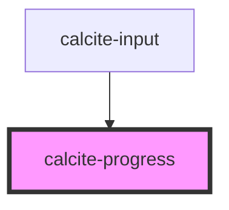

# calcite-progress

The `calcite-progress` component is used to show progress on some async task to the user.

<!-- Auto Generated Below -->

## Usage

### Basic

```html
<calcite-progress type="indeterminate"></calcite-progress>
```

## Properties

| Property   | Attribute  | Description                                                                      | Type                               | Default         |
| ---------- | ---------- | -------------------------------------------------------------------------------- | ---------------------------------- | --------------- |
| `label`    | `label`    | Accessible name for the component.                                               | `string`                           | `undefined`     |
| `reversed` | `reversed` | When true and for indeterminate progress bars, reverses the animation direction. | `boolean`                          | `false`         |
| `text`     | `text`     | Text that displays under the component's indicator.                              | `string`                           | `undefined`     |
| `type`     | `type`     | Use indeterminate if finding actual progress value is impossible.                | `"determinate" \| "indeterminate"` | `"determinate"` |
| `value`    | `value`    | The component's progress value, with a range of 0.0 - 1.0.                       | `number`                           | `0`             |

## Dependencies

### Used by

- [calcite-input](../input)

### Graph



---

_Built with [StencilJS](https://stenciljs.com/)_
