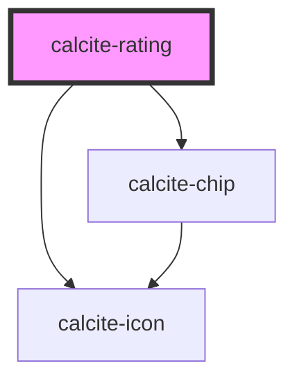

# calcite-rating

<!-- Auto Generated Below -->

## Usage

### Basic

```html
<calcite-rating
  show-chip
  scale="m"
  value="0"
  average="4.4"
  count="10"
  intl-rating="Rating"
  intl-stars="Rating"
></calcite-rating>
```

## Properties

| Property           | Attribute           | Description                                                                                                                                                                                                                                         | Type                | Default     |
| ------------------ | ------------------- | --------------------------------------------------------------------------------------------------------------------------------------------------------------------------------------------------------------------------------------------------- | ------------------- | ----------- |
| `average`          | `average`           | Specifies a cumulative average from previous ratings to display.                                                                                                                                                                                    | `number`            | `undefined` |
| `count`            | `count`             | Specifies the number of previous ratings to display.                                                                                                                                                                                                | `number`            | `undefined` |
| `disabled`         | `disabled`          | When `true`, interaction is prevented and the component is displayed with lower opacity.                                                                                                                                                            | `boolean`           | `false`     |
| `intlRating`       | `intl-rating`       | <span style="color:red">**[DEPRECATED]**</span> – translations are now built-in, if you need to override a string, please use `messageOverrides`<br/><br/>Accessible name for the component.                                                        | `string`            | `undefined` |
| `intlStars`        | `intl-stars`        | <span style="color:red">**[DEPRECATED]**</span> – translations are now built-in, if you need to override a string, please use `messageOverrides`<br/><br/>Accessible name for each star. The `${num}` in the string will be replaced by the number. | `string`            | `undefined` |
| `messageOverrides` | `message-overrides` | Use this property to override individual strings used by the component.                                                                                                                                                                             | `Messages`          | `undefined` |
| `name`             | `name`              | Specifies the name of the component on form submission.                                                                                                                                                                                             | `string`            | `undefined` |
| `readOnly`         | `read-only`         | When `true`, the component's value can be read, but cannot be modified.                                                                                                                                                                             | `boolean`           | `false`     |
| `scale`            | `scale`             | Specifies the size of the component.                                                                                                                                                                                                                | `"l" \| "m" \| "s"` | `"m"`       |
| `showChip`         | `show-chip`         | When `true`, and if available, displays the `average` and/or `count` data summary in a `calcite-chip`.                                                                                                                                              | `boolean`           | `false`     |
| `value`            | `value`             | The component's value.                                                                                                                                                                                                                              | `number`            | `0`         |

## Events

| Event                 | Description                               | Type                              |
| --------------------- | ----------------------------------------- | --------------------------------- |
| `calciteRatingChange` | Fires when the component's value changes. | `CustomEvent<{ value: number; }>` |

## Methods

### `setFocus() => Promise<void>`

Sets focus on the component.

#### Returns

Type: `Promise<void>`

## CSS Custom Properties

| Name                            | Description                                                           |
| ------------------------------- | --------------------------------------------------------------------- |
| `--calcite-rating-spacing-unit` | The amount of left and right margin spacing between each rating star. |

## Dependencies

### Depends on

- [calcite-icon](../icon)
- [calcite-chip](../chip)

### Graph



---

_Built with [StencilJS](https://stenciljs.com/)_
