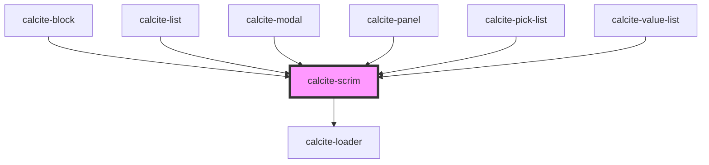

# calcite-scrim

<!-- Auto Generated Below -->

## Usage

### Basic

```html
<div style="position: relative; width: 200px; height: 200px; overflow: auto;">
  <calcite-scrim>
    <p>I'm a panel that is not loading.</p>
    <p>This content can have any zIndex and it will not be placed above</p>
    <p>.</p>
    <p>.</p>
    <p>.</p>
    <p>.</p>
  </calcite-scrim>
</div>
```

### Loading-scrim-panel

```html
<div style="position: relative; width: 200px; height: 200px; overflow: auto;">
  <calcite-scrim loading>
    <p>I'm a panel that is not loading.</p>
    <p>I have a loading spinner over my content.</p>
    <p>.</p>
    <p>.</p>
    <p>.</p>
    <p>.</p>
  </calcite-scrim>
</div>
```

## Properties

| Property           | Attribute           | Description                                                                                                                                                                                              | Type       | Default     |
| ------------------ | ------------------- | -------------------------------------------------------------------------------------------------------------------------------------------------------------------------------------------------------- | ---------- | ----------- |
| `intlLoading`      | `intl-loading`      | <span style="color:red">**[DEPRECATED]**</span> – translations are now built-in, if you need to override a string, please use `messageOverrides`<br/><br/>Accessible name when the component is loading. | `string`   | `undefined` |
| `loading`          | `loading`           | When `true`, a busy indicator is displayed.                                                                                                                                                              | `boolean`  | `false`     |
| `messageOverrides` | `message-overrides` | Use this property to override individual strings used by the component.                                                                                                                                  | `Messages` | `undefined` |

## Slots

| Slot | Description                                                      |
| ---- | ---------------------------------------------------------------- |
|      | A slot for adding custom content, primarily loading information. |

## Dependencies

### Used by

- [calcite-block](../block)
- [calcite-list](../list)
- [calcite-modal](../modal)
- [calcite-panel](../panel)
- [calcite-pick-list](../pick-list)
- [calcite-value-list](../value-list)

### Depends on

- [calcite-loader](../loader)

### Graph



---

_Built with [StencilJS](https://stenciljs.com/)_
