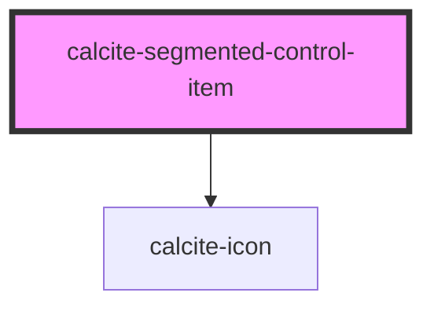

# calcite-segmented-control-item

<!-- Auto Generated Below -->

## Properties

| Property      | Attribute       | Description                                                                                  | Type      | Default     |
| ------------- | --------------- | -------------------------------------------------------------------------------------------- | --------- | ----------- |
| `checked`     | `checked`       | When `true`, the component is checked.                                                       | `boolean` | `false`     |
| `iconEnd`     | `icon-end`      | Specifies an icon to display at the end of the component.                                    | `string`  | `undefined` |
| `iconFlipRtl` | `icon-flip-rtl` | When `true`, the icon will be flipped when the element direction is right-to-left (`"rtl"`). | `boolean` | `false`     |
| `iconStart`   | `icon-start`    | Specifies an icon to display at the start of the component.                                  | `string`  | `undefined` |
| `value`       | `value`         | The component's value.                                                                       | `any`     | `undefined` |

## Dependencies

### Depends on

- [calcite-icon](../icon)

### Graph

---

_Built with [StencilJS](https://stenciljs.com/)_
