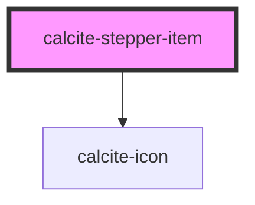

# calcite-stepper-item

individual `calcite-stepper-item` item

<!-- Auto Generated Below -->

## Properties

| Property       | Attribute       | Description                                                                                                        | Type      | Default     |
| -------------- | --------------- | ------------------------------------------------------------------------------------------------------------------ | --------- | ----------- |
| `active`       | `active`        | is the step active                                                                                                 | `boolean` | `false`     |
| `complete`     | `complete`      | has the step been completed                                                                                        | `boolean` | `false`     |
| `description`  | `description`   | stepper item description                                                                                           | `string`  | `undefined` |
| `disabled`     | `disabled`      | is the step disabled and not navigable to by a user                                                                | `boolean` | `false`     |
| `error`        | `error`         | does the step contain an error that needs to be resolved by the user                                               | `boolean` | `false`     |
| `heading`      | `heading`       | stepper item heading                                                                                               | `string`  | `undefined` |
| `itemSubtitle` | `item-subtitle` | **[DEPRECATED]** use description instead  pass a title for the stepper item | `string`  | `undefined` |
| `itemTitle`    | `item-title`    | **[DEPRECATED]** use heading instead  pass a title for the stepper item     | `string`  | `undefined` |

## Methods

### `setFocus() => Promise<void>`

#### Returns

Type: `Promise<void>`

## Slots

| Slot | Description                       |
| ---- | --------------------------------- |
|      | A slot for adding custom content. |

## Dependencies

### Depends on

- [calcite-icon](../icon)

### Graph

---

_Built with [StencilJS](https://stenciljs.com/)_
