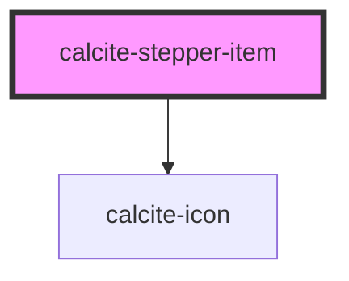

# calcite-stepper-item

individual `calcite-stepper-item` item

<!-- Auto Generated Below -->

## Properties

| Property      | Attribute       | Description                                                                                  | Type      | Default     |
| ------------- | --------------- | -------------------------------------------------------------------------------------------- | --------- | ----------- |
| `complete`    | `complete`      | When `true`, the step has been completed.                                                    | `boolean` | `false`     |
| `description` | `description`   | A description for the component. Displays below the header text.                             | `string`  | `undefined` |
| `disabled`    | `disabled`      | When `true`, interaction is prevented and the component is displayed with lower opacity.     | `boolean` | `false`     |
| `error`       | `error`         | When `true`, the component contains an error that requires resolution from the user.         | `boolean` | `false`     |
| `heading`     | `heading`       | The component header text.                                                                   | `string`  | `undefined` |
| `iconFlipRtl` | `icon-flip-rtl` | When `true`, the icon will be flipped when the element direction is right-to-left (`"rtl"`). | `boolean` | `false`     |
| `selected`    | `selected`      | When `true`, the component is selected.                                                      | `boolean` | `false`     |

## Methods

### `setFocus() => Promise<void>`

Sets focus on the component.

#### Returns

Type: `Promise<void>`

## Slots

| Slot | Description                       |
| ---- | --------------------------------- |
|      | A slot for adding custom content. |

## Dependencies

### Depends on

- [calcite-icon](../icon)

### Graph

---

_Built with [StencilJS](https://stenciljs.com/)_
