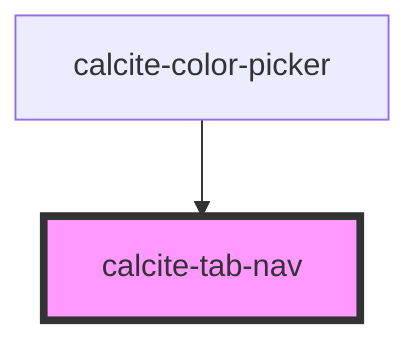

# calcite-tab-nav

The tab-nav groups several [calcite-tab-title](../tab-title) components and builds out the navigation. You can optionally use attibutes on the tab-nav to configure client side storage of the selected tab.

<!-- Auto Generated Below -->

## Usage

### Basic

When tab-nav is the only parent, tab-title can inherit its `scale` and `position` from tab-nav:

```html
<calcite-tab-nav scale="l" position="bottom">
  <calcite-tab-title>Layers</calcite-tab-title>
  <calcite-tab-title>Maps</calcite-tab-title>
  <calcite-tab-title selected>Data</calcite-tab-title>
</calcite-tab-nav>
```

## Properties

| Property        | Attribute    | Description                                                                   | Type                         | Default     |
| --------------- | ------------ | ----------------------------------------------------------------------------- | ---------------------------- | ----------- |
| `selectedTitle` | --           | Specifies the component's selected tab-title.                                 | `HTMLCalciteTabTitleElement` | `null`      |
| `storageId`     | `storage-id` | Specifies the name when saving selected `calcite-tab` data to `localStorage`. | `string`                     | `undefined` |
| `syncId`        | `sync-id`    | Specifies text to update multiple components to keep in sync if one changes.  | `string`                     | `undefined` |

## Events

| Event              | Description                                    | Type                |
| ------------------ | ---------------------------------------------- | ------------------- |
| `calciteTabChange` | Emits when the selected `calcite-tab` changes. | `CustomEvent<void>` |

## Slots

| Slot | Description                             |
| ---- | --------------------------------------- |
|      | A slot for adding `calcite-tab-title`s. |

## Dependencies

### Used by

- [calcite-color-picker](../color-picker)

### Graph



---

_Built with [StencilJS](https://stenciljs.com/)_
