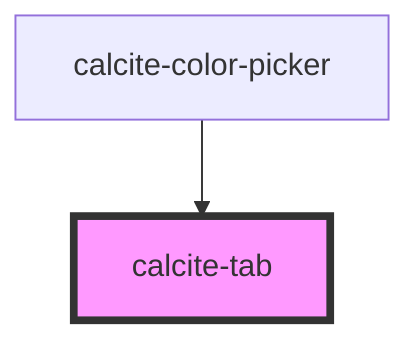

# calcite-tab

<!-- Auto Generated Below -->

## Usage

### Basic

`calcite-tab` wraps the content you would like to appear when that tab is selected:

```html
<calcite-tab>My stuff!</calcite-tab>
```

## Properties

| Property   | Attribute  | Description                                                                                           | Type      | Default     |
| ---------- | ---------- | ----------------------------------------------------------------------------------------------------- | --------- | ----------- |
| `active`   | `active`   | <span style="color:red">**[DEPRECATED]**</span> Use selected instead.<br/><br/>Show this tab          | `boolean` | `false`     |
| `selected` | `selected` | When true, display this tab.                                                                          | `boolean` | `false`     |
| `tab`      | `tab`      | Optionally include a unique name for this tab, be sure to also set this name on the associated title. | `string`  | `undefined` |

## Methods

### `getTabIndex() => Promise<number>`

Return the index of this tab within the tab array

#### Returns

Type: `Promise<number>`

## Slots

| Slot | Description                       |
| ---- | --------------------------------- |
|      | A slot for adding custom content. |

## Dependencies

### Used by

- [calcite-color-picker](../color-picker)

### Graph



---

_Built with [StencilJS](https://stenciljs.com/)_
