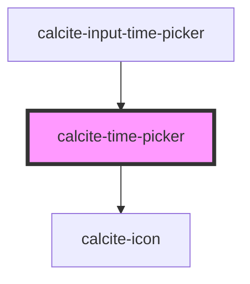

# calcite-time-picker

<!-- Auto Generated Below -->

## Properties

| Property           | Attribute            | Description                                                                                                                                                                                                                 | Type                                                                                                                                                                                                                                    | Default     |
| ------------------ | -------------------- | --------------------------------------------------------------------------------------------------------------------------------------------------------------------------------------------------------------------------- | --------------------------------------------------------------------------------------------------------------------------------------------------------------------------------------------------------------------------------------- | ----------- |
| `intlHour`         | `intl-hour`          | **[DEPRECATED]** - translations are now built-in, if you need to override a string, please use `messageOverrides`  Accessible name for the component's hour input.                   | `string`                                                                                                                                                                                                                                | `undefined` |
| `intlHourDown`     | `intl-hour-down`     | **[DEPRECATED]** - translations are now built-in, if you need to override a string, please use `messageOverrides`  Accessible name for the component's hour down button.             | `string`                                                                                                                                                                                                                                | `undefined` |
| `intlHourUp`       | `intl-hour-up`       | **[DEPRECATED]** - translations are now built-in, if you need to override a string, please use `messageOverrides`  Accessible name for the component's hour up button.               | `string`                                                                                                                                                                                                                                | `undefined` |
| `intlMeridiem`     | `intl-meridiem`      | **[DEPRECATED]** - translations are now built-in, if you need to override a string, please use `messageOverrides`  Accessible name for the component's meridiem (AM/PM) input.       | `string`                                                                                                                                                                                                                                | `undefined` |
| `intlMeridiemDown` | `intl-meridiem-down` | **[DEPRECATED]** - translations are now built-in, if you need to override a string, please use `messageOverrides`  Accessible name for the component's meridiem (AM/PM) down button. | `string`                                                                                                                                                                                                                                | `undefined` |
| `intlMeridiemUp`   | `intl-meridiem-up`   | **[DEPRECATED]** - translations are now built-in, if you need to override a string, please use `messageOverrides`  Accessible name for the component's meridiem (AM/PM) up button.   | `string`                                                                                                                                                                                                                                | `undefined` |
| `intlMinute`       | `intl-minute`        | **[DEPRECATED]** - translations are now built-in, if you need to override a string, please use `messageOverrides`  Accessible name for the component's minute input.                 | `string`                                                                                                                                                                                                                                | `undefined` |
| `intlMinuteDown`   | `intl-minute-down`   | **[DEPRECATED]** - translations are now built-in, if you need to override a string, please use `messageOverrides`  Accessible name for the component's minute down button.           | `string`                                                                                                                                                                                                                                | `undefined` |
| `intlMinuteUp`     | `intl-minute-up`     | **[DEPRECATED]** - translations are now built-in, if you need to override a string, please use `messageOverrides`  Accessible name for the component's minute up button.             | `string`                                                                                                                                                                                                                                | `undefined` |
| `intlSecond`       | `intl-second`        | **[DEPRECATED]** - translations are now built-in, if you need to override a string, please use `messageOverrides`  Accessible name for the component's second input.                 | `string`                                                                                                                                                                                                                                | `undefined` |
| `intlSecondDown`   | `intl-second-down`   | Accessible name for the component's second down button.                                                                                                                                                                     | `string`                                                                                                                                                                                                                                | `undefined` |
| `intlSecondUp`     | `intl-second-up`     | **[DEPRECATED]** - translations are now built-in, if you need to override a string, please use `messageOverrides`  Accessible name for the component's second up button.             | `string`                                                                                                                                                                                                                                | `undefined` |
| `messageOverrides` | `message-overrides`  | Use this property to override individual strings used by the component.                                                                                                                                                     | `Messages`                                                                                                                                                                                                                              | `undefined` |
| `numberingSystem`  | `numbering-system`   | Specifies the Unicode numeral system used by the component for localization.                                                                                                                                                | `"arab" \| "arabext" \| "bali" \| "beng" \| "deva" \| "fullwide" \| "gujr" \| "guru" \| "hanidec" \| "khmr" \| "knda" \| "laoo" \| "latn" \| "limb" \| "mlym" \| "mong" \| "mymr" \| "orya" \| "tamldec" \| "telu" \| "thai" \| "tibt"` | `undefined` |
| `scale`            | `scale`              | Specifies the size of the component.                                                                                                                                                                                        | `"l" \| "m" \| "s"`                                                                                                                                                                                                                     | `"m"`       |
| `step`             | `step`               | Specifies the granularity the `value` must adhere to (in seconds).                                                                                                                                                          | `number`                                                                                                                                                                                                                                | `60`        |
| `value`            | `value`              | The component's value in UTC (always 24-hour format).                                                                                                                                                                       | `string`                                                                                                                                                                                                                                | `null`      |

## Methods

### `setFocus(target: TimePart) => Promise<void>`

Sets focus on the component.

#### Returns

Type: `Promise<void>`

## Dependencies

### Used by

- [calcite-input-time-picker](../input-time-picker)

### Depends on

- [calcite-icon](../icon)

### Graph

---

_Built with [StencilJS](https://stenciljs.com/)_
