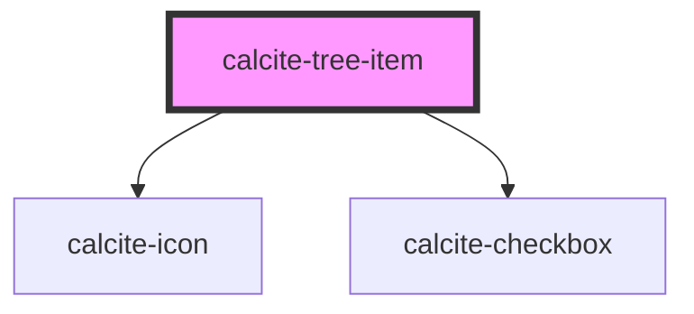

# calcite-tree-item

`<calcite-tree-item>` is used to represent a single item in a `<calcite-tree>`.

<!-- Auto Generated Below -->

## Properties

| Property   | Attribute  | Description                 | Type      | Default |
| ---------- | ---------- | --------------------------- | --------- | ------- |
| `expanded` | `expanded` | Expanded state of the item. | `boolean` | `false` |
| `selected` | `selected` | Selected state of the item. | `boolean` | `false` |

## Slots

| Slot         | Description                                     |
| ------------ | ----------------------------------------------- |
|              | A slot for adding content to the item.          |
| `"children"` | A slot for adding nested calcite-tree elements. |

## Dependencies

### Depends on

- [calcite-icon](../icon)
- [calcite-checkbox](../checkbox)

### Graph

---

_Built with [StencilJS](https://stenciljs.com/)_
