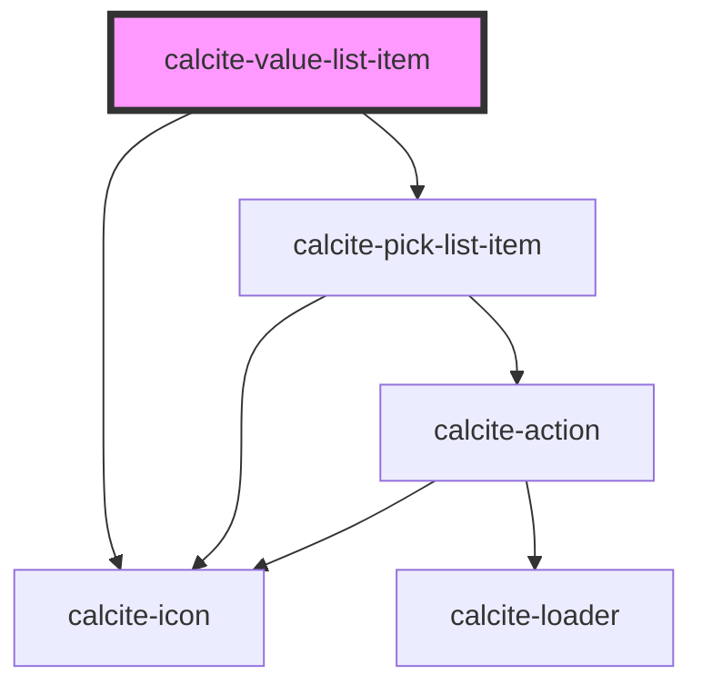

# calcite-value-list-item

`calcite-value-list-item`s are cards contained in a `calcite-value-list`. They each can have a label and description, an icon and can have their label's be editable (inherited from `calcite-value-list`). The developer can disable or preselect each list item and give it a value.

<!-- Auto Generated Below -->

## Properties

| Property             | Attribute         | Description                                                                                  | Type                                                        | Default     |
| -------------------- | ----------------- | -------------------------------------------------------------------------------------------- | ----------------------------------------------------------- | ----------- |
| `description`        | `description`     | An optional description for the list item that displays below the label text.                | `string`                                                    | `undefined` |
| `disabled`           | `disabled`        | When true, the list item cannot be clicked and is visually muted.                            | `boolean`                                                   | `false`     |
| `icon`               | `icon`            | Determines the icon SVG symbol that will be shown. Options are circle, square, grip or null. | `ICON_TYPES.circle \| ICON_TYPES.grip \| ICON_TYPES.square` | `null`      |
| `label` _(required)_ | `label`           | The main label for the list item. Appears next to the icon.                                  | `string`                                                    | `undefined` |
| `metadata`           | --                | Provides additional metadata to a list item. Primary use is for a filter on the parent list. | `{ [x: string]: unknown; }`                                 | `undefined` |
| `nonInteractive`     | `non-interactive` | When true, prevents the content of the list item from user interaction.                      | `boolean`                                                   | `false`     |
| `removable`          | `removable`       | When true, adds an action to remove the list item.                                           | `boolean`                                                   | `false`     |
| `selected`           | `selected`        | When true, preselects the list item. Toggles when an item is checked/unchecked.              | `boolean`                                                   | `false`     |
| `value` _(required)_ | `value`           | The list item's associated value.                                                            | `any`                                                       | `undefined` |

## Events

| Event                   | Description                              | Type                |
| ----------------------- | ---------------------------------------- | ------------------- |
| `calciteListItemRemove` | Emits when the remove button is pressed. | `CustomEvent<void>` |

## Methods

### `setFocus() => Promise<void>`

Set focus on the component.

#### Returns

Type: `Promise<void>`

### `toggleSelected(coerce?: boolean) => Promise<void>`

Toggle the selection state. By default this won't trigger an event.
The first argument allows the value to be coerced, rather than swapping values.

#### Returns

Type: `Promise<void>`

## Slots

| Slot              | Description                                                         |
| ----------------- | ------------------------------------------------------------------- |
| `"actions-end"`   | A slot for adding actions or content to the end side of the item.   |
| `"actions-start"` | A slot for adding actions or content to the start side of the item. |

## Dependencies

### Depends on

- [calcite-icon](../icon)
- [calcite-pick-list-item](../pick-list-item)

### Graph

---

_Built with [StencilJS](https://stenciljs.com/)_
